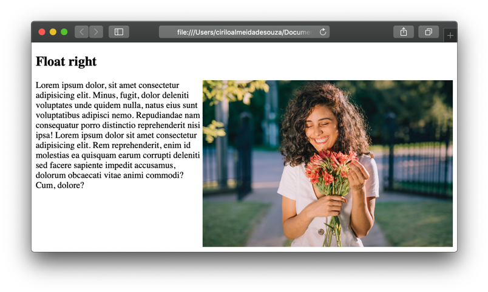
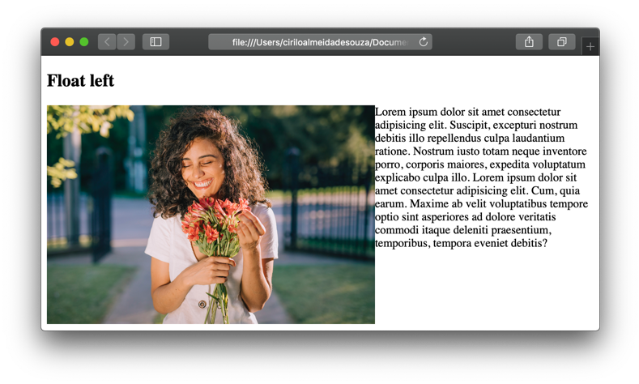
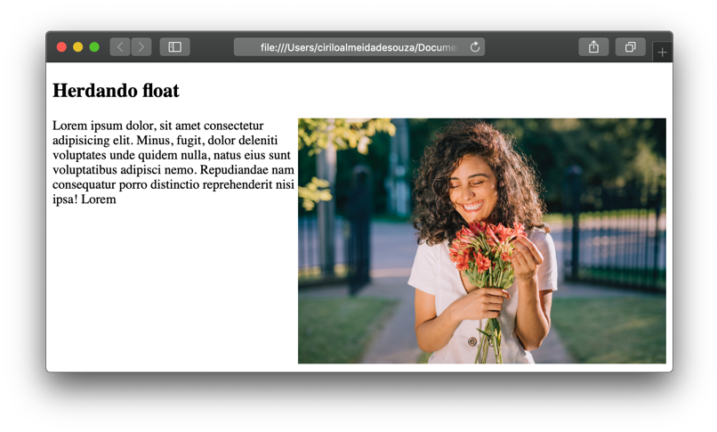
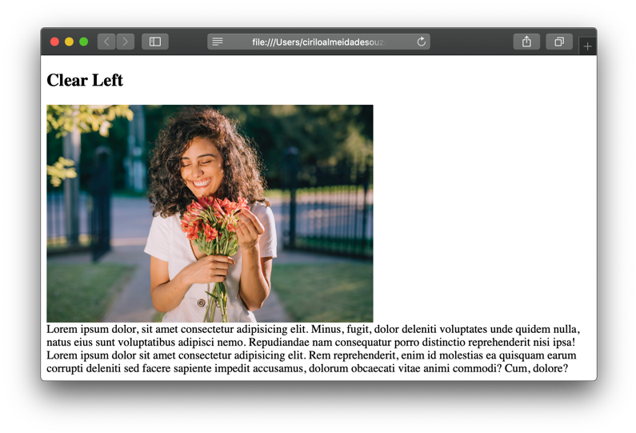

## Float

Como já falamos (e acho que não custa falar de novo! Rs) os elementos de bloco são posicionados um abaixo dos outros. Podemos mudar essa característica para que elementos de bloco flutuem ao lado de outros elementos, como por exemplo deixar uma imagem ao lado de um texto.
Com o float, conseguimos informar como será o posicionamento deste elemento, se a esquerda ou direita.

```css
  .flutuando-a-direita{ float: right; }
```
  


```css
  .flutuando-a-direita{ float: left; }
```
  

  
  
Podemos fazer que um elemento filho herde essa característica do pai. 

```css
  .herda-flutuacao{ float: right; }
  .herda-flutuacao img{ float: inherit; }
```
  
  

  
   
&nbsp;
  
  
### Clear:
A propriedade clear especifica se um elemento pode flutuar ao lado de outro e em qual lado ele pode flutuar. 

```css
  .limpa-flutuacao{ clear: left; }
```
  
Por exemplo o texto está flutuando a esquerda, nós aplicamos o estilo na imagem para que não permita que tenha nenhum elemento flutuando a sua esquerda.
  
  

  
  
&nbsp;
  
  
[< Retornar à página principal](../README.md)
  
[Ir para a próxima página >](11-Position.md)
