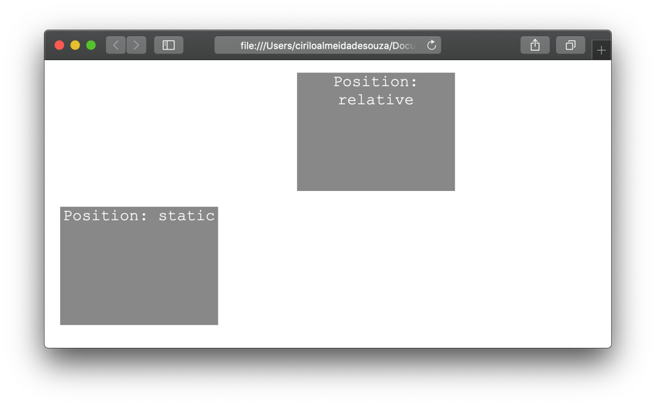
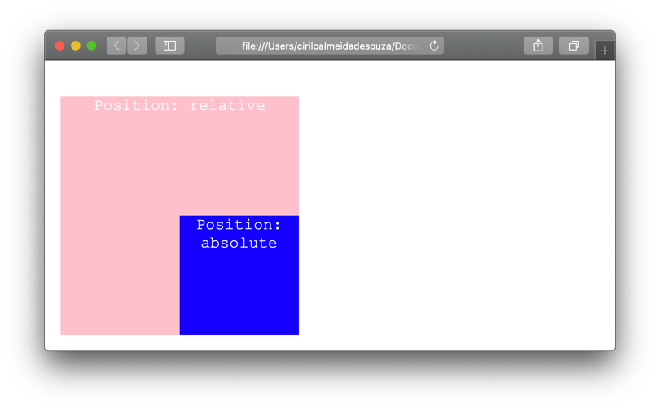
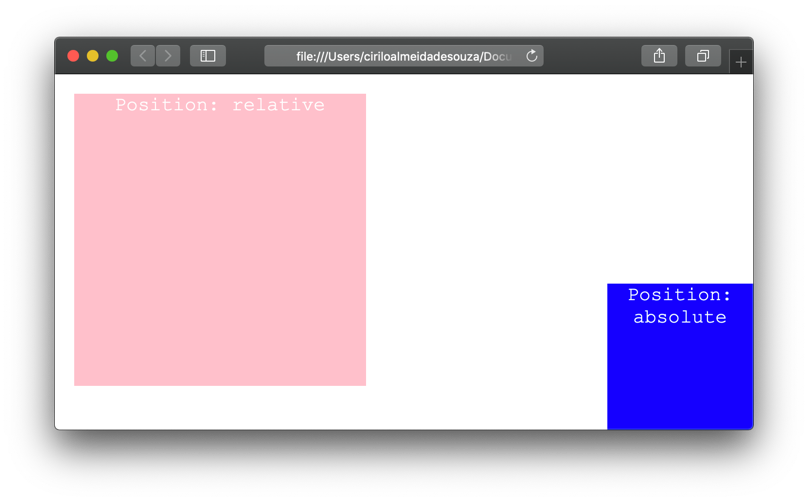
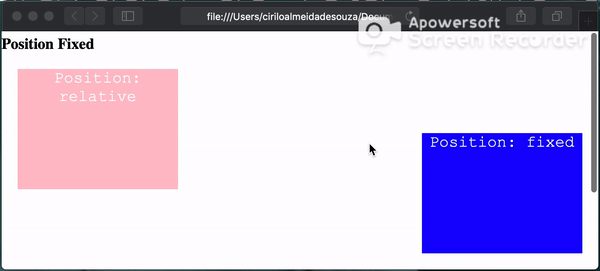
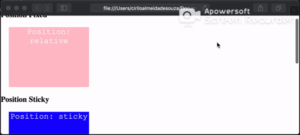
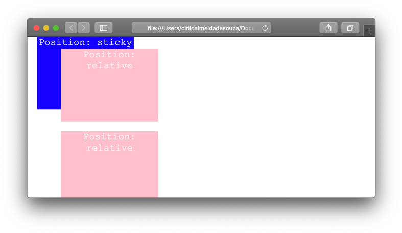
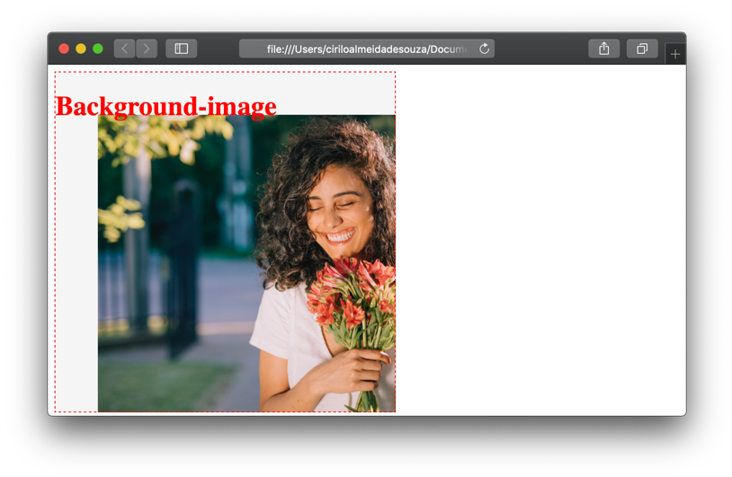

# Position

A propriedade position serve para posicionar um elemento dentro da página web. Ela pode levar em consideração o posicionamento com relação ao tamanho da tela no qual o site está sendo exibido ou com relação ao seu elemento pai.
Para posicionar o elemento na página informamos a distância com relação a parte superior, esquerda, direita ou inferior através das propriedades top, left, right ou bottom.
  
Por padrão todos os elementos HTML têm o posicionamento estático (position: static), não precisamos declarar explicitamente porque o navegador interpreta de forma automática.
  
  
&nbsp;
  
   

## Posição relativa
Um elemento com posicionamento relativo é posicionado na tela com relação a sua posição original, ou seja, a posição estática. Quando alteramos a sua posição normal, o elemento deixa um buraco que não é preenchido por outros elementos próximos a ele.

```css
  #el1{
      position: relative;
      left: 200px;
  }

  #el2{
      position: static;
  }
```
  
  

  
  
&nbsp;
  
   
## Posição absolute
O elemento com posição absoluta, leva em consideração a posição do elemento pai.
  
**HTML**

```
<html>
  <body>
      <div id="el1">
          Position relative
          <div id="el2">
              Position absolute
          </div>
      </div>
  </body>
</html>
```
  
**CSS**

```css
  #el1{
      position: relative;
  }

  #el2{
      position: absolute;
      right: 0;
      bottom: 0;
  }
```
  
  

  
Se o elemento não tivesse um pai, ele seria posicionado com relação a página web.
  
**HTML**

```
<html>
  <body>
    <div id="el1">
        Position relative
    </div>

    <div id="el2">
        Position absolute
    </div>

  </body>
</html>
```
  
**CSS**

```css
  #el1{
      position: relative;
  }

  #el2{
      position: absolute;
      right: 0;
      bottom: 0;
  }
```
  
  


  
  
&nbsp;
  
   
## Position Fixed

O elemento é posicionado de acordo com a tela na qual o website é mostrado. Ele permanece na mesma posição mesmo durante a rolagem da página.
  
**HMTL**

```
<html>
  <body>
      <div id="el1">
          Position relative
      </div>

      <div id="el2">
          Position fixed
      </div>
  </body>
</html>
```
  
**CSS**

```css
  #el1{
      position: relative;
      top: 500px;
  }

  #el2{
      position: fixed;
      right: 0;
      top: 0;
  }
```
  


  
  
&nbsp;
  
   
## Position Sticky

O elemento com posicionamento sticky possui na verdade duas propriedades de posicionamentos o relative e o fixed. Podemos posicioná-lo por exemplo no topo da página, desta forma, a posição inicial seria relative. Ao rolarmos a página para baixo quando o elemento atingisse o topo da página sua posição mudará para fixed.

```css
  #el1, #el3{
      position: relative;
  }

  #el2{
      position: -webkit-sticky;
      position: sticky;
      top: 0;
  }
```
  
  

  
Repare que utilizamos duas propriedades position, uma com o valor sticky e outra com -webkit-sticky. Isso porque o Safari depende desta propriedade especial para que o elemento tenha o comportamento que desejamos. 
Este tipo de configuração é comum pois muitos navegadores não suportam as determinadas propriedades CSS de forma nativa.

  
  
&nbsp;
  
   
## Z-index

Quando aplicamos um posicionamento ao elemento HTML, um elemento pode sobrepôs o outro. No caso do sticky que utilizamos acima, o elemento ficará posicionado na parte superior da página e todo o resto ao rolarmos a página passará por trás dele, dando a impressão de há duas camadas.
Nós podemos mudar este comportamento através da propriedade z-index.


```css
  #el3{
      position: relative;
      z-index: 1;
  }
```
  

  
O elemento com a propriedade z-index: 1 aparecerá na tela na frente, ou seja, aquele que tiver a propriedade mais alta será posicionado acima na pilha. 

  
  
&nbsp;
  
   
## Background Position

A propriedade position, também pode ser usada para posicionar uma imagem de background. Esta propriedade aceita até dois valores referentes aos eixos X (horizontal) e Y (vertical).

```css
  #el3{
      background-position-x: 50px; 
      background-position-y: 50px;
  }
```
  

  
  
Ou podemos declarar os valores dos eixos X e Y juntos com a propriedade background-position.

```css
  #el3{ background-position: 50px 50px; }
```
  
Outros valores que podemos utilizar na propriedade background-position.
  
  
| Valor        | Descrição                              |
|--------------|----------------------------------------|
| left         | Posiciona a esquerda                   |
| Right        | Posiciona a direita                    |
| Top          | Posiciona na parte superior            |
| Bottom       | Posiciona na parte inferior            |
| Center       | Posiciona no centro                    |
| Left top     | Posiciona da parte superior a esquerda |
| Left center  | Posiciona no centro a esquerda         |
| Left bottom  | Posiciona na parte inferior a esquerda |
| Right top    | Posiciona na parte superior a direita  |
| Right center | Posiciona no centro a direita          |
| Right bottom | Posiciona na parte inferior a direita  |

  
  
&nbsp;
  
   
[< Retornar à página principal](../README.md)
  
  
[Ir para a próxima página >](12-Tabelas.md)
