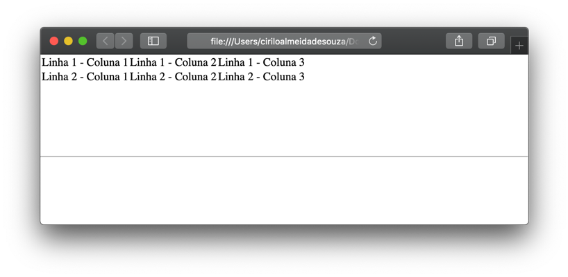
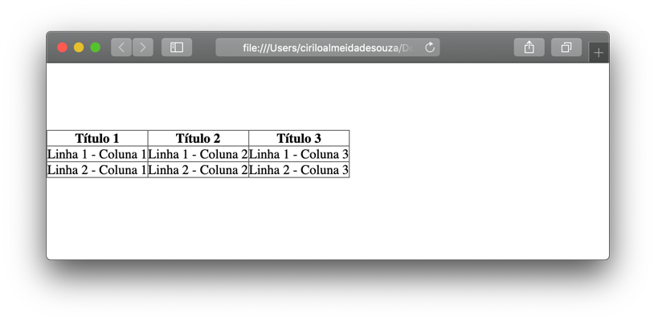
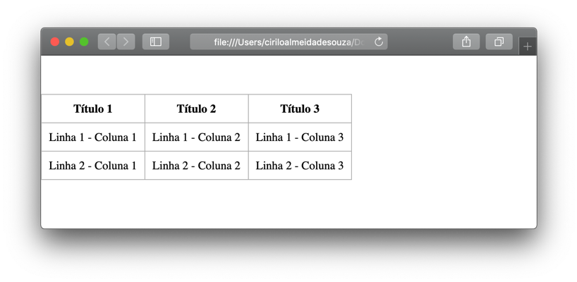
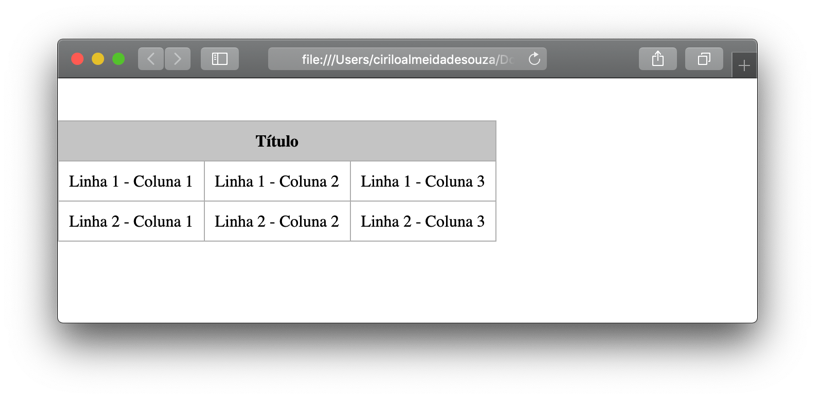
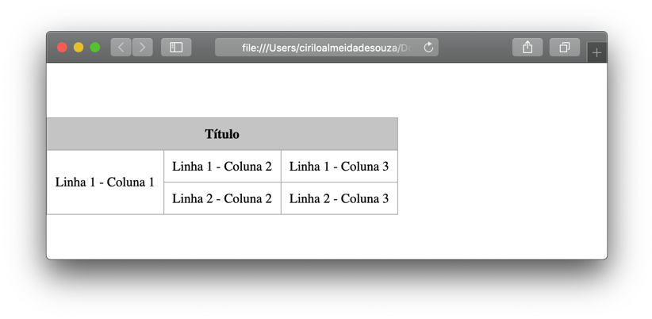
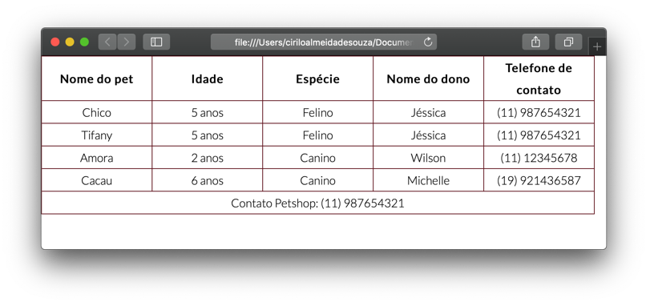
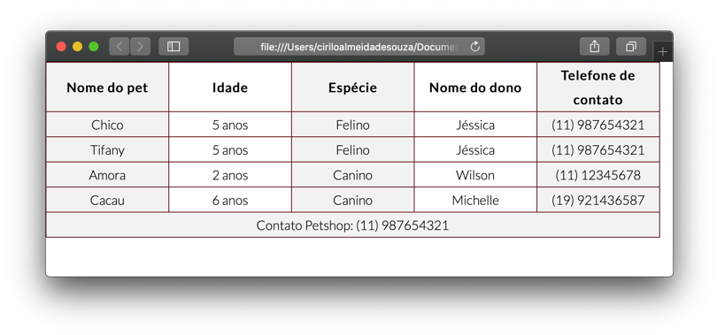

# Tabelas

As tabelas representam informações formatadas como planilhas com linhas e colunas, é muito comum mostrarmos esse tipo de conteúdo na web, como por exemplo em formulários, sites passagens aéreas, cardápios de restaurante, etc. 
  
  
&nbsp;
  
  

## Criando uma tabela

Para criarmos uma tabela utilizamos o elemento \<table\>, cada linha da tabela é definida pelo elemento \<tr\> e cada célula é definida pelo elemento \<td\>.

```
<html>
  <body>
      <table>
          <tr>
              <td>Esta é a primeira célula</td>
          </tr>
          <tr>
              <td>Esta é a segunda célula</td>
          </tr>
      </table>
  </body>
</html>
```
  
  

  
  
Os títulos das colunas são definidos através do elemento \<th\>, ele funciona da mesma forma que um  \<td\> mas é útil para pessoas com deficiência que utilizam aplicativos de leitura de tela e também para o rankeamento da página nos mecanismos de busca.
Caso haja alguma célula vazia, como no exemplo acima, devemos representa-la com o \<td\> ou \<th\> (se for um título) vazios. Pois, desta forma o layout não fica quebrado. 

**HTML**

```
<html>
  <body>
       <table>
        <th>Título 1</th>
        <th>Título 2</th>
        <th>Título 3</th>
        <tr>
            <td>Linha 1 - Coluna 1</td>
            <td>Linha 1 - Coluna 2</td>
            <td>Linha 1 - Coluna 3</td>
        </tr>
        <tr>
            <td>Linha 2 - Coluna 1</td>
            <td>Linha 2 - Coluna 2</td>
            <td>Linha 2 - Coluna 3</td>
        </tr>
    </table>
  </body>
</html>
```

**CSS**

```css
  table, th, td, td{
      border: 1px solid #5d5d5d;
      border-collapse: collapse;
  }
```
  
  

  
  
Repare que o \<th\> deixa o texto do título em negrito, é possível usarmos o <th> não apenas como título da coluna, mas também de uma linha, para isto, basta inserí-lo dentro de uma \<tr\>.  

É meio chato mostrar as tabelas sem bordas, cores, etc. Então vamos fazer uma pausa no HTML e usar o CSS para estilizarmos a tabela que já criamos.
No nosso arquivo HTML, não se esqueça de informar o caminho do arquivo de estilo CSS dentro do \<head\> através do elemento \<link\>. 
  
  
**HMTL**

```
<html>
  <head>
      <meta charset="UTF-8">
      <link rel="stylesheet" href="style.css">
      <title>Criando uma tabela!</title>
  </head>
</html>
```

**CSS**

```css
  table, th, td{
      border: 1px solid #f2f2f2; /*Cria uma borda de 1px na cor cinza*/
      border-collapse: collapse; /*Reduz o espaçamento entre as bordas*/
  }

  th, td{
      padding: 10px; /*Cria um espaçamento de 10px entre a borda e o texto*/
      text-align: center; /*Alinha o texto no centro das céluas*/ 
  }
```
  
  


  
  
&nbsp;
  
  
## Mesclando células

As vezes é preciso que o título de uma coluna se estenda por duas ou mais colunas para fazermos isso utilizamos o atributo colspan, e informamos o número de colunas que queremos mesclar.
  
  
**HTML**

```
<html>
  <body>
    <table>
      <th colspan="3">Título</th>
      <tr>
          <td>Linha 1 - Coluna 1</td>
          <td>Linha 1 - Coluna 2</td>
          <td>Linha 1 - Coluna 3</td>
      </tr>
      <tr>
          <td>Linha 2 - Coluna 1</td>
          <td>Linha 2 - Coluna 2</td>
          <td>Linha 2 - Coluna 3</td>
      </tr>
  </table>
  </body>
</html>
```
  
  

  
  
Apliquei um estilo no CSS para \<th\> para ficar com esse background em cinza.


```css
  th{ background: #f2f2f2; }
```
  
  
Da mesma forma que utilizamos o colspan para mesclar duas colunas, também podemos mesclar duas linhas com o atributo rowspan.

```
<html>
  <body>
    <table>
      <th colspan="3">Título</th>
      <tr>
          <td rowspan="3">Linha 1 - Coluna 1</td>
          <td>Linha 1 - Coluna 2</td>
          <td>Linha 1 - Coluna 3</td>
      </tr>
      <tr>
          <td>Linha 2 - Coluna 2</td>
          <td>Linha 2 - Coluna 3</td>
      </tr>
  </table>
  </body>
</html>
```
  
  


  
  
&nbsp;
  
  
## Planilhas semânticas

Legal, já aprendemos a criar uma tabela com suas linhas e colunas, mas este exemplo foi algo bem básico. Agora imagine que as tabelas que serão criadas para websites serão bem maiores que essa aqui! 
Neste caso, existem três elementos que nos ajudam a distinguir o conteúdo principal da tabela e as linhas que representam o título, etc. Estes elementos são o \<thead\>, \<tbody\> e \<tfoot\>. 
  
  
**HTML**

```
<html>
  <body>
    <table>
        <thead>
            <th>Nome do pet</th>
            <th>Idade</th>
            <th>Espécie</th>
            <th>Nome do dono</th>
            <th>Telefone de contato</th>
        </thead>

        <tbody>
            <tr>
                <td>Chico</td>
                <td>5 anos</td>
                <td>Felino</td>
                <td>Jéssica</td>
                <td>(11) 987654321</td>
            </tr>
            <tr>
                <td>Tifany</td>
                <td>5 anos</td>
                <td>Felino</td>
                <td>Jéssica</td>
                <td>(11) 987654321</td>
            </tr>
            <tr>
                <td>Amora</td>
                <td>2 anos</td>
                <td>Canino</td>
                <td>Wilson</td>
                <td>(11) 12345678</td>
            </tr>
            <tr>
                <td>Cacau</td>
                <td>6 anos</td>
                <td>Canino</td>
                <td>Michelle</td>
                <td>(19) 921436587</td>
            </tr>
        </tbody>
        
        <tfoot>
            <tr>
                <td colspan="5">Contato Petshop: (11) 987654321</td>
            </tr>
        </tfoot>
      </table>
  </body>
</html>
```
  
  
**CSS**


```css
  table{
      font-family: 'Lato', sans-serif;
      font-weight: 300;
  }

  table, thead, tbody, tfoot, th, tr, td{
      border: 1px solid #bbbbbb;
      border-collapse: collapse;
      border-color: #5D0E19;
  }

  th, td{
      width: 150px;
      line-height: 30px;
      font-size: 16px;
      text-align: center
  }
```
  
  

  
  
&nbsp;
  
  
## Estilizando grupos de colunas

É possível aplicar o estilo inline (direto no HTML), mas não recomendo fazer isso porque a manutenção da página Web se tornará uma dor de cabeça futuramente. Vamos supor que você queria aplicar um cor de fundo em uma coluna específica, ou em linhas alternadas, se você fosse fazer isso direto no código HTML teria que aplicar o estilo em cada um dos \<td\>s que você gostaria que tenham a cor de fundo, já deu pra sentir quanto trabalho você terá né?
Para isso, o HTML 5 introduziu uma forma de aplicar esse estilo em um só lugar sem ter que utilizar recursos mais avançados do CSS, são os elementos \<col\> e \<colgroup\>. 

```
<html>
  <body>
    <table>
      <colgroup>
          <col class="col">
          <col>
          <col class="col">
          <col>
          <col class="col">
      </colgroup>
    </table>
  </body>
</html>
```
  
  
No arquivo CSS, criamos um único estilo aplicado aos dois ids “col2” e “col4”.

```css
  .col{ background-color:#f2f2f2; }
```
  
  


  
Veja como ficou o código final da nossa tabela:

```
<html>
  <body>
    <table>
    <colgroup>
        <col class="col">
        <col>
        <col class="col">
        <col>
        <col class="col">
    </colgroup>

    <thead>
        <th>Nome do pet</th>
        <th>Idade</th>
        <th>Espécie</th>
        <th>Nome do dono</th>
        <th>Telefone de contato</th>
    </thead>

    <tbody>
        <tr>
          <td>Chico</td>
          <td>5 anos</td>
          <td>Felino</td>
          <td>Jéssica</td>
          <td>(11) 987654321</td>
        </tr>
        <tr>
          <td>Tifany</td>
          <td>5 anos</td>
          <td>Felino</td>
          <td>Jéssica</td>
          <td>(11) 987654321</td>
        </tr>
        <tr>
          <td>Amora</td>
          <td>2 anos</td>
          <td>Canino</td>
          <td>Wilson</td>
          <td>(11) 12345678</td>
        </tr>
        <tr>
          <td>Cacau</td>
          <td>6 anos</td>
          <td>Canino</td>
          <td>Michelle</td>
          <td>(19) 921436587</td>
        </tr>
    </tbody>
    <tfoot>
        <tr>
          <td colspan="5">Contato Petshop: (11) 987654321</td>
        </tr>
    </tfoot>
    </table>
  </body>
</html>
```
  
  
&nbsp;
  
  
[< Retornar à página principal](../README.md)
  
  
[Ir para a próxima página >](13-Estilizando-tabelas-com-CSS.md)
