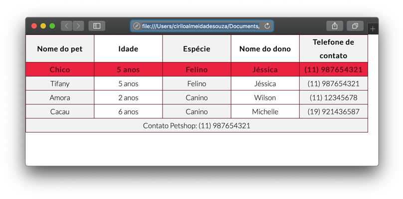
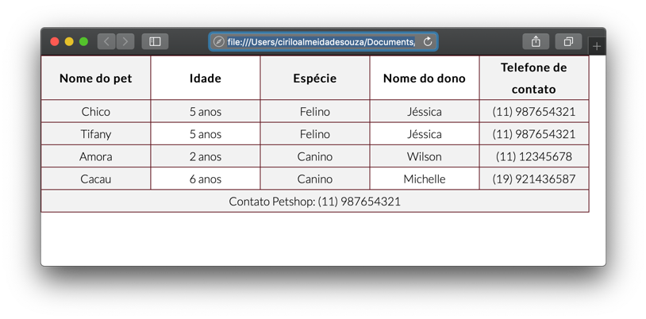
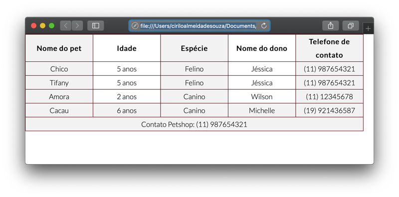

# Estilizando tabela com CSS
  
  
&nbsp;
  
  
Primeiro vamos mudar a fonte da nossa planilha para Montserrat. Vamos baixa-la do Google Fonts e importar para o arquivo CSS através do @import como vimos na sessão Fontes do capítulo [Aplicando estilo com CSS](9-Aplicando-estilo-com-CSS.md).
Através do seletor table, altere a propriedade font-family.

```css
    table{ font-family: 'Lato', sans-serif; }
```
  
  
&nbsp;
  
  
## Pseudo classe
  
  
&nbsp;
  
  
Utilizamos as pseudo classes para definir o estado de um elemento em situações específicas, como por exemplo quando o usuário passa o mouse sobre uma linha da tabela.

### Hover:
A pseudo classe hover atribui um estilo ao elemento quando o usuário passa o mouse sobre ele. Neste caso, quando o usuário passar o mouse sobre a linha da tabela iramos aplicar uma cor de fundo e estilizar a cor da fonte.


```css
  tr:hover{
      background-color: #27d5f5;
      color: #134275
  }
```
  
  


  
  
&nbsp;
  
  
Vamos supor que nós queremos que a nossa tabela tenha um estilo zebrado, onde as linhas ímpares têm um background cinza e as linhas pares branco, como a mostrado aqui embaixo:

```css
  tbody tr:nth-child(odd){
      background-color: #f2f2f2;
  }
```
  
  

  
  
Repare que a segunda, quarta e sexta linhas estão com a cor cinza.
A pseudo classe ntn-child(), seleciona um filho específico de um elemento. Neste caso, informamos ao navegador para pegar os filhos de tbody tr pares, se quisermos as linhas ímpares, é só substituir o parâmetro **odd** por **even**.
Se quisermos somente a quarta linha tenha essa formatação, bastaria inserir o número 4 como parâmetro.

```css
    tbody tr:nth-child(4){
        background-color: #f2f2f2;
    }
```
  
  

  
  
&nbsp;
  
  
### First-child:
A pseudo classe ```first-child```, pega o primeiro filho do elemento especificado. Por exemplo, se quisermos pegar a primeira linha da tabela, podemos combinar dois seletores thead tr:first-child.

  


```
<style>
</style>
```

  
  
&nbsp;
  
  
[< Retornar à página principal](../README.md)
  
  
[Ir para a próxima página >](14-Formulários.md)
