# Formulários
  
  
&nbsp;
  
   
 A Web está cheia de formulários, seja uma página de login, um cadastro, uma página de contatos, tudo isso são formulários! E saber como manusear eles é um diferencial para quem quer trabalhar como Web Designer ou Frontend Developer (*a propósito esta é uma área que cresce a cada dia e está escassa de bons profissionais, portanto #ficaadica*). 
Neste capítulo daremos uma introdução aos Web Forms como são chamados e como estiliza-los através do CSS. 
  
  
&nbsp;
  
   
 ## O que são os web forms?
   
  
&nbsp;
  
   
 Os formulários são uma das principais formar de interação do publico alvo com o site. Através deles os usuários conseguem enviar mensagens, fazer cadastro, login, etc. 
   
Porém os formulários são o elo mais fraco no ponto de vista de segurança, isso porque alguns desenvolvedores frontend descuidados não tomam o devido cuidado durante o desenvolvimento e acabam deixando o site vulnerável a ataques.
  
Outro ponto muito importante para ficarmos atentos é com relação a usabilidade do formulário.

*Usabilidade? Oi? Isso aí… Essa palavra é nova! *

Um formulário que gere uma boa experiência para o usuário garante que o usuário complete ele sem maiores atritos, ou seja, sem dor para o usuário! Este é outro ponto muitas vezes negligenciado pelos desenvolvedores, que enchem os formulários com campos aparentemente desnecessários. 

*Vai dizer que você nunca teve que preencher um formulário de cadastro que parecia interminável?
Ou foi obrigado a fazer um cadastro e contar toda sua vida só para comprar um ingresso para o cinema?*

Aqui o planejamento se torna essencial, desenhe antes o formulário e questione-se ou questione os demandantes do projeto sobre quais campos serão solicitados no formulário e se eles são realmente necessários. Tenha sempre em mente que menos é mais.
  
  
&nbsp;
  
   
 ## Estrutura do formulário
   
  
&nbsp;
  
   
 Todos os formulários começam com o elemento \<form\>, ele define o início. Já o final é definido pelo elemento \</form\>. Assim como qualquer elemento HTML o \<form\> possui atributos como por exemplo o ```action``` e o ```method```.
  
  
&nbsp;
  
   
 ### Atributo action:
 
 O action define para onde os dados coletados pelo <form> serão enviados, seu valor deve ser uma URL para um servidor web que executará alguma ação de acordo com o valor recebido.
  
  
&nbsp;
  
   
 ### Atributo method:
 
 O atributo method pode conter os valores ```GET```, ```POST```, ```PUT```, ```DELETE``` ou ```PATCH```. O ```GET``` é responsável coletar os dados, sua solicitação e os parâmetros são passados no cabeçalho da requisição ficando visível na barra de endereço do navegador. 
 

  
  
&nbsp;
  
   
 Já o método ```POST```, é responsável por enviar os dados para o servidor, como os campos de usuário e senha por exemplo. Os dados não ficam visíveis na barra de endereço do navegador. 
Se quisermos atualizar os dados, podemos utilizar o ```PUT```, que substitui todas as informações de um determinado recurso, por exemplo um produto. Para deletar recursos utilizamos o ```DELETE``` e para atualizar as informações utilizamos o ```PATCH```.
  
  
O nosso código ficaria desta forma:

```html
    <form action="/cadastro.html" method="POST">
    	  Conteúdo do formulário aqui
    </form>
```
  
  
&nbsp;
  
   
 ## Criando um formulário
  
  
&nbsp;
  
   
 ### Elemento Label:
 
 O elemento \<label\> cria um pequeno texto, geralmente é utilizado antes dos elementos de \<input\> como descrição do campo, o atributo for indica a qual \<input\> aquele \<label\> pertence de acordo com o seu atributo id.
 
 ```html
    <form action="/cadastro.html" method="POST">
        <label for="rdf">Feminino</label>
        <input type="radio" name="genero" value="F" id="rdf">

        <label for="rdm">Masculino</label>
        <input type="radio" name="genero" value="M" id="rdm">
    </form>
```
  
  
&nbsp;
  
   
### Elemento Input:

O \<input\> é o elemento mais importante do formulário, serve para entrada de dados e também pode conter atributos que estendem suas funcionalidades.
  
  
  * Atributo type: Aqui temos alguns valores que podemos colocar no atributo type
  
| Valor          | Descrição                                                                                                                    |
|----------------|------------------------------------------------------------------------------------------------------------------------------|
| button         | Cria um botão clicável.                                                                                                      |
| checkbox       | Cria um capo de checkbox onde múltiplas opções podem ser selecionadas.                                                       |
| color          | Cria um color picker (selecionador de cores).                                                                                |
| date           | Cria um controle de data (dia – mês – ano).                                                                                  |
| datetime-local | Cria um controle de horas (dia – mês – ano – horas).                                                                         |
| email          | Cria um campo de email onde é obrigatório inserir o @.                                                                       |
| file           | Cria um campo de seleção de arquivo.                                                                                         |
| hidden         | Define o campo como oculto.                                                                                                  |
| image          | Define uma imagem como botão de submit (enviar).                                                                             |
| month          | Cria um campo de mês.                                                                                                        |
| number         | Cria um campo onde os únicos valores permitidos são números.                                                                 |
| password       | Cria um campo de senha. A senha fica oculta e é substituída por asteriscos.                                                  |
| radio          | Cria um campo de seleção radio onde somente uma opção pode ser selecionada.                                                  |
| range          | Cria um campo parecido com um slider.                                                                                        |
| reset          | Cria um botão de reset (limpa todas as informações preenchidas no formulário).                                               |
| search         | Cria um campo de busca.                                                                                                      |
| submit         | Define um botão de submit (enviar).                                                                                          |
| tel            | Cria um campo onde é possível inserir números de telefones.                                                                  |
| text           | É o atributo padrão do type, se nenhum outro atributo for informado o formulário assumirá que se trata de um campo de texto. |
| time           | Cria um campo de controle de horas.                                                                                          |
| url            | Cria um campo de URL.                                                                                                        |
| week           | Cria um campo de controle de semanas.                                                                       
  
  

```html
    <form action="/cadastro.html" method="POST">
        <label for="Formulário de exemplo">Formulário de exemplo</label>
 <!-- Cria um campo de texto -->
        <input placeholder="Digite seu texto aqui">

<!-- Cria um botão com o texto "Clique aqui" -->
        <input type="button" value="Clique aqui" id="btn">
    </form>
```
  
  
 
   
  
&nbsp;
  
   
### Atributo size: 

O atributo size serve para configurarmos a quantidade de caracteres aceitas pelo \<input\>. Atualmente controlamos o size através de CSS mas em alguns casos você poderá dar manutenção em um código antigo.

### Atributo name:

Quando enviamos os dados do formulário para o servidor, geralmente uma linguagem de programação como o Javascript está por trás no servidor e irá capturar esses dados para trata-los antes de enviar para um banco de dados. Para trata-los ela precisará saber algo que identifica a origem daquele dado, para isso utilizamos o atributo name.  

### Atributo placeholder:

O atributo placeholder cria um valor padrão de preenchimento do input, muitos desenvolvedores utilizam o placeholder como uma dica de como aquele campo deve ser preenchido.

### Elemento Fildset:
Você pode agrupar elementos que façam parte do mesmo contexto utilizando o \<fildset\>, como por exemplo agrupar campos de endereço em um formulário.

```html
    <h2>Formulario com fieldset</h2>
    <form action="/cadastro.html" method="POST">
      <label>Formulário de Cadastro</label>
      <fieldset>
        <p>
          <label for="street">Endereço</label>
          <input type="text" name="street" id="street">
        </p>
        <p>
          <label for="number">N.</label>
          <input type="number" name="numebr" id="number">
        </p>        
        <p>
          <label for="neighborhood">Bairro</label>
          <input type="text" name="neighborhood" id="neighborhood">
        </p>        
        <p>
          <label for="zipcode">CEP</label>
          <input type="number" name="zipcode" id="zipcode">
        </p>  
        <p>
          <label for="city">Cidade</label>
          <input type="text" name="city" id="city">
        </p>   
        <p>
          <label for="state">Estado</label>
          <input type="text" name="state" id="state">
        </p>
      </fieldset>
      <input type="submit" name="send" value="Enviar" id="send">
    </form>	
```
  
  
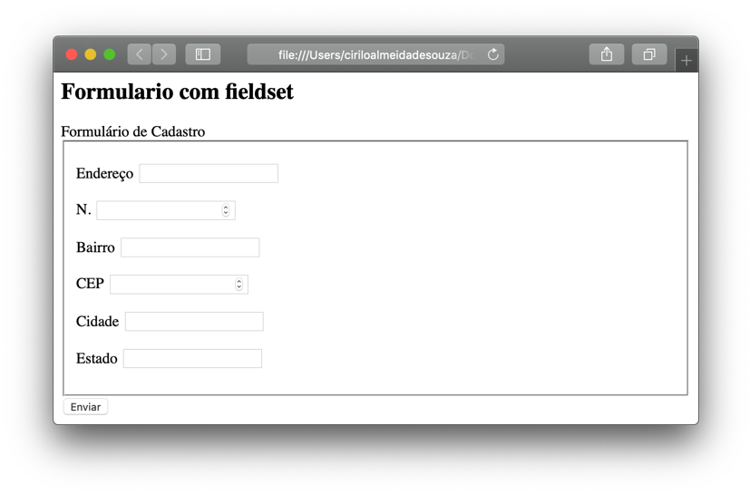
  
  
&nbsp;
  
   
Podemos utilizar também o elemento <legend> em conjunto com o \<fildeset\> para dar um nome para aquele conjunto de campos.

```html
    <h2>Formulário com Legend</h2>
    <form id="dados" method="post" action="">
      <fieldset> <!--traça uma borda-->
        <legend>Dados de Acesso</legend> <!--separa em blocos-->
        <p>
        <label for="nome" > Nome: </label>
        <input type="text" id="nome" placeholder="Seu nome completo" required autofocus /> <!--Input type: tipo da entrada, placeholder: exemplo de preenchimento-->
        </p>

        <p>
        <label for="usuario"> Usuário: </label>
        <input type="text" id="usuario" placeholder="Seu usuário" required /> 
        </p>

        <p>
        <label for="senha"> Senha: </label>
        <input type="password" id="senha" placeholder="Sua senha" maxlength="5" required /> 
        </p>

      </fieldset>
    </form>
```
  
  
&nbsp;
  
   
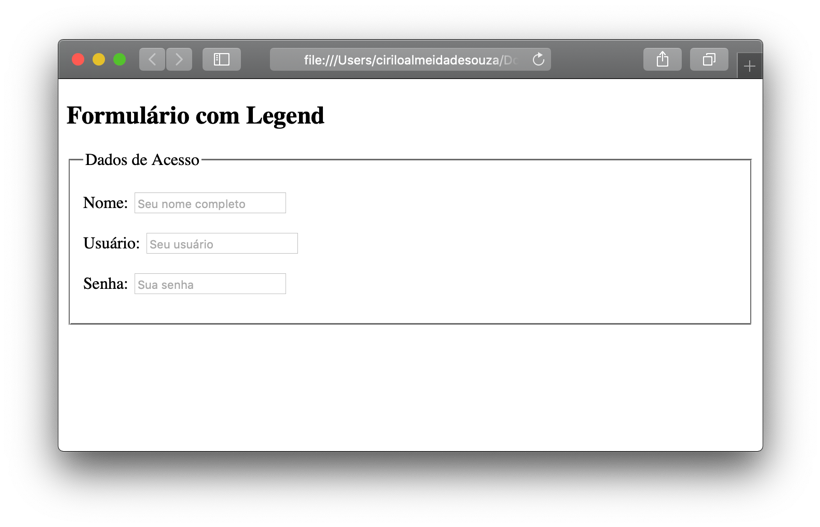
  
  
&nbsp;
  
   
```html
    <form id="dados" method="post" action="">
      <fieldset>
          <legend>Dados pessoais</legend>
          <p>
              <label for="formacao">Formação:</label>
              <select id="formacao">
                  <option value="-1">Selecione uma opção</option>
                  <option value="Ensino Fundamental">Ensino Fundamental</option>
                  <option value="Ensino Médio">Ensino Médio</option>
                  <option value="Graduação">Graduação</option>
                  <option value="MBA">MBA</option>
                  <option value="Mestrado">Mestrado</option>
                  <option value="Doutorado">Doutorado</option>
              </select>
          </p>

          <p>
              <label for="sexo">Sexo:</label>
              <input type="radio" name="sexo" value="masculino" id="masc" />
              <label for="masc"> Masculino </label> 
              <input type="radio" name="sexo" value="feminino" id="fem"/> 
              <label for="fem"> Feminino </label>
          </p>

          <p>
              <label for="preferencias">Preferências:</label>
              <input type="checkbox" name="praia" value="praia" id="praia" checked/> 
              <label for="praia">Praia</label> <!--clicar na palavra pra selecionar-->
              <input type="checkbox" name="selva" value="selva"/> Selva
              <input type="checkbox" name="campo" value="campo"/> Campo
              <input type="checkbox" name="montanha" value="montanha"/> Montanha
          </p>

          <p>
              <label for="coment">Comentários</label><br/>
              <textarea placeholder="Fala ai rapaz"></textarea>
          </p>

          </p>
              <label for="arquivos">Enviar arquivos</label><br/>
              <input type="file" id="arquivos"/>  
          </p>
      </fieldset>
    </form>
```
  
  
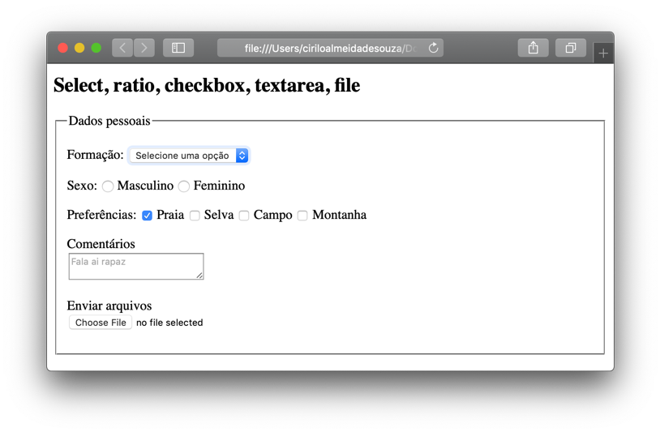
  
  
&nbsp;
  
   
```html
    <form action="">
      <fieldset> 
        <legend>Controle HTML5</legend> 
        <p>
          <label for="email">Email:</label>
          <input type="email" id="email" required />
        </p>
        <p>
          <label for="apartamento">Apartamento:</label>
          <input type="number" id="apartamento" required />
        </p>

        <p>
          <label for="buscar">Pesquisa:</label>
          <input type="search" id="buscar" required />
        </p>

        <p>
          <label for="site">Seu site:</label>
          <input type="url" id="site" required />
        </p>

        <p>
          <label for="nascimento">Data de nascimento:</label>
          <input type="date" id="nascimento" required />
        </p>

        <p>
          <label for="hora">Hora de nascimento:</label>
          <input type="time" id="hora" required />
        </p>

        <p>
          <label for="entrega">Data e hora de entrega:</label>
          <input type="datetime-local" id="entrega" required />
        </p>

        <p><!-- renderiza a paleta de cores do seu sistema -->
          <label for="fileira">Fileira cor:</label>
          <input type="color" id="fileira" required />
        </p>

        <p><!-- cria escala de valores -->
          <label for="escala">Selecione a luminosidade:</label>
          <input type="range" id="escala" min="10" max="20" step="5" required />
        </p>
      </fieldset>
      <input type="submit" value="Enviar dados">
      <input type="reset" value="Apagar">
     </form>
```
  
  
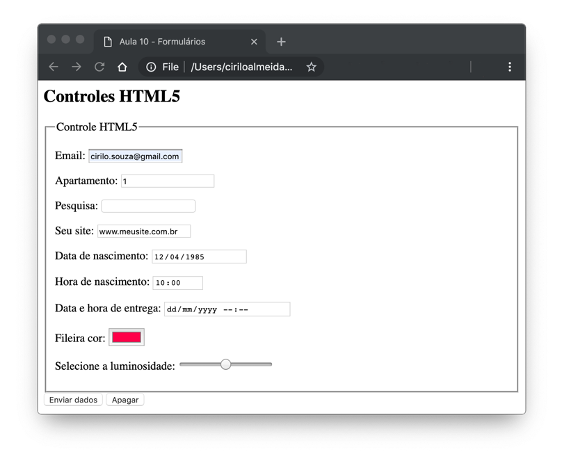
  
  
&nbsp;
  
   
### Elemento Select:

O \<select\> cria uma lista drop-down, ao clicarmos sobre ele, ele abre um pequeno menu com diversas opções. Estas opções são definidas pelo elemento \<option\>.

```html
		<form action="/animais.html" method="GET">
			<select name="animais">
				<option value="gato">Gato</option>
				<option value="cachorro">Cachorro</option>
				<option value="papagaio">Papagaio</option>
				<option value="periquito">Periquito</option>
			</select>
		</form>
```
  
  
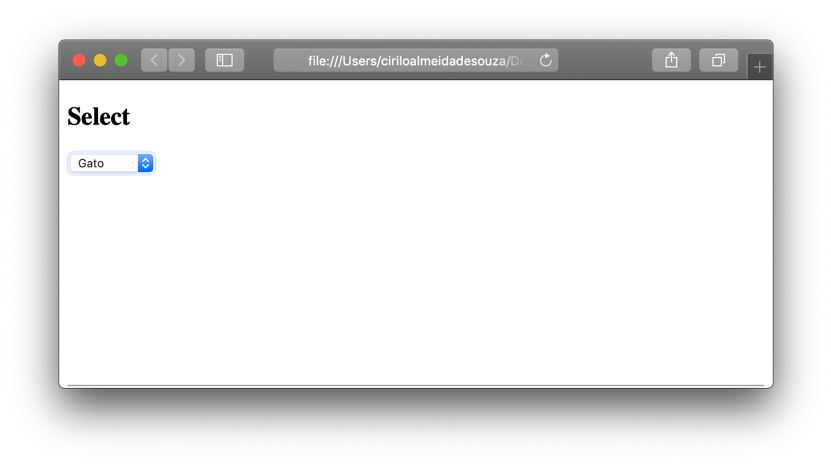
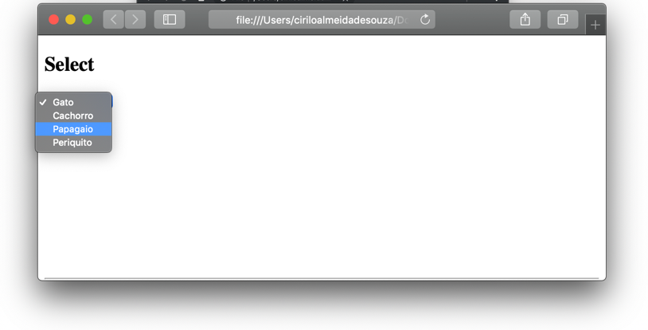
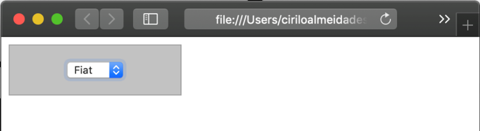
  
  
Por padrão sempre a primeira opção virá selecionada, porém é possível mudar este comportamento utilizando o atributo vazio selected no elemento que você deseja que apareça selecionado.
  
  
&nbsp;
  
   
### Elemento Textarea:

O elemento \<textarea\> cria um campo onde é possível inserir um texto grande, a diferença entre ele e um \<input\> é que com o \<textarea\> é possível configurar a quantidade de linhas que o elemento terá, limitando desta forma a quantidade de caracteres do campo com o atributo rows. Também é possível configurar o tamanho do campo como o atributo cols.
 
```html
    <form action="/cadastro.html" method="GET">
        <textarea cols="30" rows="3"> 
        </textarea>
    </form>
```

Se a quantidade de texto for maior que o campo, podemos dar um scroll com o mouse dentro dele para ler todo o texto. Ou podemos redimensionar clicando na borda inferior direita.
  
  
&nbsp;
  
   
### Elemento Datalist:

Com o surgimento do HTML5 novos elementos de formulário foram criados, como por exemplo o \<datalist\> e o \<output\>. O \<datalist\> cria um conjunto de opções pré-definidas para um \<input\>. Porém temos que ter um certo cuidado porque estas opções podem não ser mostradas em navegadores antigos, é preciso consultar a lista de navegadores suportados antes de utilizá-lo.

```html
    <form action="/browsers.html">
        <input list="browsers">
        <datalist id="browsers">
            <option value="Internet Explorer">
            <option value="Firefox">
            <option value="Chrome">
            <option value="Opera">
            <option value="Safari">
        </datalist> 
    </form>
```
  
  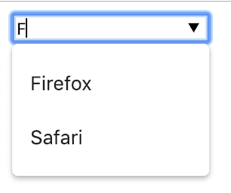
  
  
&nbsp;
  
   
| NAVEGADORES SUPORTADOS   |               |
|--------------------------|---------------|
| NAVEGADOR                | VERSÃO MÍNIMA |
| Chrome                   | 20.0          |
| Internet Explorer / Edge | 10.0          |
| Firefox                  | 4.0           |
| Opera                    | 9.0           |
| Safari                   | Não suportado |

  
  
&nbsp;
  
   
### Elemento Output:

O \<output\>, retorna o resultado de um cálculo matemático. Para que o cálculo seja efetuado precisamos informar ao formulário que ele deve ser feito, caso o contrário ele não irá realizar o cálculo.
Para fazer isso, vamos inserir no nosso formulário os elementos \<input\> e \<output\>. É importante alterarmos o type dos \<input\>s para number, caso contrário ocorrerá um erro ao fazer o cálculo. 

```html
    <form>
        <input type="number" id="a">
        <input type="number" id="b">
       <output id="x"></output>
    </form>
```
  
  
Feito isso, vamos inserir o atributo for ao nosso <output> o for será responsável por fazer o relacionamento entre os campos do formulário, ou seja, quais campos serão usados para o cálculo matemático.

```html
    <form>
        <input type="number" id="a">
        <input type="number" id="b">
        <output for="a b" id="x"></output>
    </form>
```
  
  
Agora precisamos falar para o formulário como o cálculo deve ser feito, utilizaremos o atributo oninput, este atributo captura tudo o que é inserido nos \<input\>s.

```html
    <form oninput="x.value=parseFloat(a.value) + parseFloat(b.value)">
        <input type="number" id="a"> +
        <input type="number" id="b"> =
        <output for="a b" id="x"></output>
    </form>
```
  
  
Basicamente o que nós falamos ao formulário foi, “ao serem inseridos números (oninput), atribua ao elemento X (x.value) o resultado da soma entre A e B (parseFloat(a.value) + parseFloat(b.value))”. 
  
  
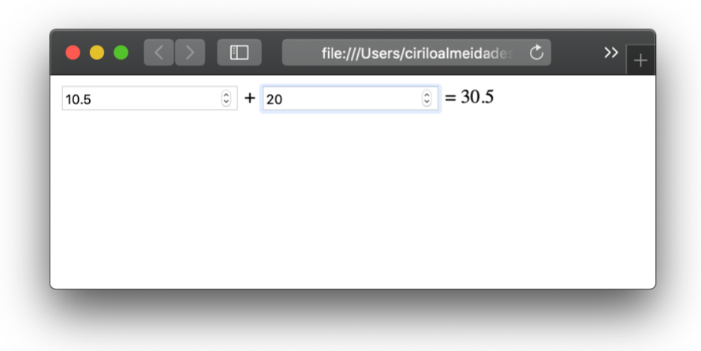
  
  
&nbsp;
  
   
Para saber mais sobre formulários, visite a página do (Mozilla)[https://developer.mozilla.org/pt-BR/docs/Learn/HTML/Forms/The_native_form_widgets]
  
  
&nbsp;
  
   
## Para onde vão os dados do formulário?
  
  
&nbsp;
  
   
A arquitetura básica da web é baseada no modelo de cliente / servidor, ou seja, um cliente (nossos celulares, computadores, tablets, etc) enviam solicitações através de um protocolo de rede para servidores (servidores que provêm um serviço na web). É obvio que não é algo tão simples assim, a infraestrutura de rede é muito mais complexa, porém não é o nosso objetivo estudá-la em detalhes neste curso. 
Cada dispositivo em uma rede possui um endereço IP (endereço que identifica o dispositivo dentro da rede). Este endereço é único dentro da rede no qual está inserido. 
Cada dispositivo se comunica com os outros através de um protocolo de rede, existem diversos protocolos de rede e cada um é responsável por um tipo de comunicação eles são padrões internacionais definidos por organizações regulatórias. 
O protocolo padrão usado para a navegação na Internet é o **HTTP**. A sigla HTTP significa **H**yperText **T**ransfer **P**rotocol (*Protocolo de Transferência de HiperTexto* ).

Além do HTTP existem outros protocolos de navegação na Internet, tais como: 

* **HTTPS** (Faz a mesma coisa que o HTTP, porém de forma segura criando um túnel de comunicação entre o cliente e o servidor, desta forma, ninguém fora deste túnel consegue acessar as informações que estão sendo trocadas);
* **FTP** File Transfer Protocol (Serve para transferir arquivos de dispositivo para o outro);
* **SFTP** Secure File Transfer Protocol (Faz a mesma coisa que o FTP, porém de forma segura utilizando um protocolo de segurança que encripta a mensagem).
  
  
O protocolo HTTP faz a comunicação entre cliente e servidor através de mensagens, o cliente envia uma solicitação (*request*) e o servidor envia uma resposta (*response*).
  
  
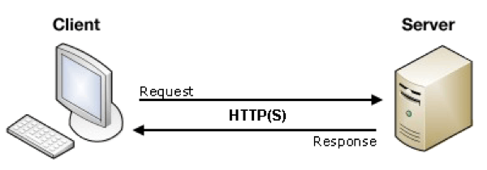
  
  
&nbsp;
  
   
```
Exemplo de um request HTTP:
Request URL: https://developer.mozilla.org/pt-BR/
Request Method: GET
Status Code: 200 
Remote Address: 52.85.160.217:443
Referrer Policy: no-referrer-when-downgrade
```
  
  
Perceba que o campo **Request Method** possui o valor **GET**, isso não parece familiar? Lembra do atributo method do elemento \<form\>?. Pois é, no lado do cliente um formulário **HTML** é nada mais do que uma maneira amigável para configurar uma solicitação HTTP para enviar dados para um servidor. Isso permite que o usuário forneça informações a serem entregues na solicitação.
O que define como essas informações serão enviadas ao servidor são os atributos method e action (que já falamos anteriormente). 
O atributo method define a forma como o protocolo HTTP irá trabalhar, dependendo do valor atribuído a ele, o protocolo HTTP trabalhará de forma diferente. Por exemplo, se utilizarmos o valor GET, o protocolo saberá que nós estamos solicitando uma informação do servidor, desta forma, ele retornará algo como resposta da nossa solicitação.
  
  
Se quiser saber mais sobre o protocolo HTTP, o site da [Mozilla](https://developer.mozilla.org/pt-BR/docs/Web/HTTP/Overview) 
  
  
&nbsp;
  
   

## Validando dados do formulário:
  
  
&nbsp;
  
   
Existem dois motivos pelo qual devemos validar os dados do formulário antes de enviá-lo para um servidor. O primeiro e primordial é por razão de segurança, por serem campos que permitem a entrada de dados, os formulários geralmente são a porta de entrada para hackers inserirem códigos maliciosos.
O segundo motivo são os usuários, é claro! Desta forma, evitamos que por engano insiram dados que não correspondam ao esperado pelo campo e podemos dar um retorno visual informando que aquele dado não é o esperado.
Existem duas formas de fazermos a validação dos dados, a primeira é do lado do cliente e segunda do lado do servidor. Nós iremos tratar da validação feita do lado do cliente, ela pode ocorrer em dois momentos, o primeiro durante a inserção do dado no campo do formulário e a segunda após a inserção do dado.
A validação feita durante a inserção é chamada de built-in validation, ou seja, é inserida por padrão quando utilizamos o atributo type. Um elemento com o atributo type="email" vai permitir que somente que endereços de e-mail sejam inseridos dentro do campo, se colocarmos qualquer outro valor que não seja um e-mail o navegador irá por padrão emitir uma notificação. 
  
  
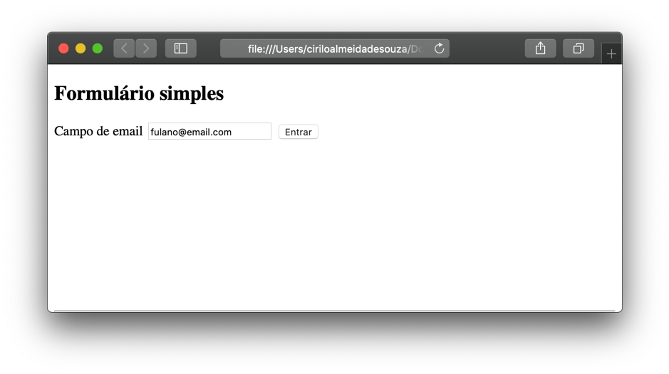
  
  
&nbsp;
  
   
Podemos mostrar ao usuário de forma visual que o que o dado inserido no campo está correto ou não simplesmente alterando a cor da borda do campo, como o Google faz quando vamos acessar a conta do GMAIL por exemplo.
Ao inserirmos um e-mail inválido o formulário altera a cor da borda para vermelho, se estiver correto ele simplesmente passa para a próxima fase que pede para o usuário digitar a senha.
  
  

  
  
Para fazer isso, usaremos os pseudos seletores :valid e :invalid no CSS.

```css
    form input:invalid{
        border: 1px solid red;
    }
```
  
  
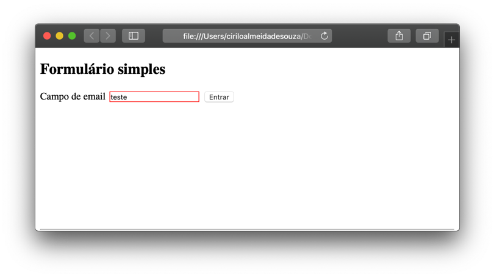
  
  
&nbsp;
  
   
Os elementos do tipo \<input\> e \<textarea\> possuem uma validação da quantidade de caracteres que podem ser inseridos pelo usuário, porém esta validação muda de acordo com o type do elemento.
Para  \<input type="text"\> e \<textare\a> utilizamos os atributos minlength e maxlength.
  
  
&nbsp;
  
   
### Atributo Minlength & Maxlength:

O minlength valida o tamanho mínimo de caracteres do campo, por exemplo: 

```html
    <input type="text" minlength="5">
```

Isso indica que o campo deve ter no mínimo 5 caracteres. 
  
  

  
  
&nbsp;
  
   
Já o maxlegth é o oposto, ele verifica o tamanho máximo do campo. O exemplo abaixo configura que o tamanho máximo do campo será de 10 caracteres, perceba que o próprio formulário não permite inserirmos mais do que 10 caracteres.

```html
    <input type="text" minlength="5" maxlength="10">
```
  
  

  
  
  
  
&nbsp;
  
   
[< Retornar à página principal](../README.md)
  
  
[Ir para a próxima página >](15-Elementos-semânticos.md)
