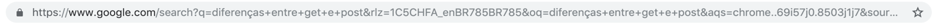
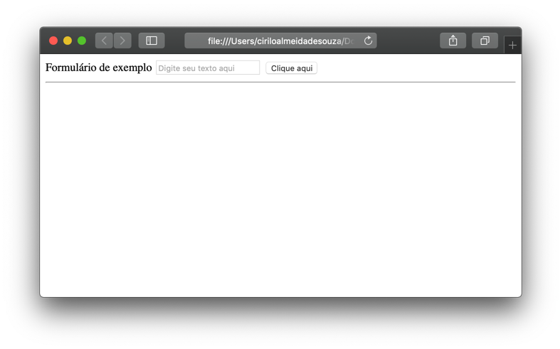

# Formulários
  
  
&nbsp;
  
   
 A Web está cheia de formulários, seja uma página de login, um cadastro, uma página de contatos, tudo isso são formulários! E saber como manusear eles é um diferencial para quem quer trabalhar como Web Designer ou Frontend Developer (*a propósito esta é uma área que cresce a cada dia e está escassa de bons profissionais, portanto #ficaadica*). 
Neste capítulo daremos uma introdução aos Web Forms como são chamados e como estiliza-los através do CSS. 
  
  
&nbsp;
  
   
 ## O que são os web forms?
   
  
&nbsp;
  
   
 Os formulários são uma das principais formar de interação do publico alvo com o site. Através deles os usuários conseguem enviar mensagens, fazer cadastro, login, etc. 
   
Porém os formulários são o elo mais fraco no ponto de vista de segurança, isso porque alguns desenvolvedores frontend descuidados não tomam o devido cuidado durante o desenvolvimento e acabam deixando o site vulnerável a ataques.
  
Outro ponto muito importante para ficarmos atentos é com relação a usabilidade do formulário.

*Usabilidade? Oi? Isso aí… Essa palavra é nova! *

Um formulário que gere uma boa experiência para o usuário garante que o usuário complete ele sem maiores atritos, ou seja, sem dor para o usuário! Este é outro ponto muitas vezes negligenciado pelos desenvolvedores, que enchem os formulários com campos aparentemente desnecessários. 

*Vai dizer que você nunca teve que preencher um formulário de cadastro que parecia interminável?
Ou foi obrigado a fazer um cadastro e contar toda sua vida só para comprar um ingresso para o cinema?*

Aqui o planejamento se torna essencial, desenhe antes o formulário e questione-se ou questione os demandantes do projeto sobre quais campos serão solicitados no formulário e se eles são realmente necessários. Tenha sempre em mente que menos é mais.
  
  
&nbsp;
  
   
 ## Estrutura do formulário
   
  
&nbsp;
  
   
 Todos os formulários começam com o elemento \<form\>, ele define o início. Já o final é definido pelo elemento \</form\>. Assim como qualquer elemento HTML o \<form\> possui atributos como por exemplo o ```action``` e o ```method```.
  
  
&nbsp;
  
   
 ### Atributo action:
 
 O action define para onde os dados coletados pelo <form> serão enviados, seu valor deve ser uma URL para um servidor web que executará alguma ação de acordo com o valor recebido.
  
  
&nbsp;
  
   
 ### Atributo method:
 
 O atributo method pode conter os valores ```GET```, ```POST```, ```PUT```, ```DELETE``` ou ```PATCH```. O ```GET``` é responsável coletar os dados, sua solicitação e os parâmetros são passados no cabeçalho da requisição ficando visível na barra de endereço do navegador. 
 

  
  
&nbsp;
  
   
 Já o método ```POST```, é responsável por enviar os dados para o servidor, como os campos de usuário e senha por exemplo. Os dados não ficam visíveis na barra de endereço do navegador. 
Se quisermos atualizar os dados, podemos utilizar o ```PUT```, que substitui todas as informações de um determinado recurso, por exemplo um produto. Para deletar recursos utilizamos o ```DELETE``` e para atualizar as informações utilizamos o ```PATCH```.
  
  
O nosso código ficaria desta forma:

```html
    <form action="/cadastro.html" method="POST">
    	  Conteúdo do formulário aqui
    </form>
```
  
  
&nbsp;
  
   
 ## Criando um formulário
  
  
&nbsp;
  
   
 ### Elemento Label:
 
 O elemento \<label\> cria um pequeno texto, geralmente é utilizado antes dos elementos de \<input\> como descrição do campo, o atributo for indica a qual \<input\> aquele \<label\> pertence de acordo com o seu atributo id.
 
 ```html
    <form action="/cadastro.html" method="POST">
        <label for="rdf">Feminino</label>
        <input type="radio" name="genero" value="F" id="rdf">

        <label for="rdm">Masculino</label>
        <input type="radio" name="genero" value="M" id="rdm">
    </form>
```
  
  
&nbsp;
  
   
### Elemento Input:

O \<input\> é o elemento mais importante do formulário, serve para entrada de dados e também pode conter atributos que estendem suas funcionalidades.
  
  
  * Atributo type: Aqui temos alguns valores que podemos colocar no atributo type
  
| Valor          | Descrição                                                                                                                    |
|----------------|------------------------------------------------------------------------------------------------------------------------------|
| button         | Cria um botão clicável.                                                                                                      |
| checkbox       | Cria um capo de checkbox onde múltiplas opções podem ser selecionadas.                                                       |
| color          | Cria um color picker (selecionador de cores).                                                                                |
| date           | Cria um controle de data (dia – mês – ano).                                                                                  |
| datetime-local | Cria um controle de horas (dia – mês – ano – horas).                                                                         |
| email          | Cria um campo de email onde é obrigatório inserir o @.                                                                       |
| file           | Cria um campo de seleção de arquivo.                                                                                         |
| hidden         | Define o campo como oculto.                                                                                                  |
| image          | Define uma imagem como botão de submit (enviar).                                                                             |
| month          | Cria um campo de mês.                                                                                                        |
| number         | Cria um campo onde os únicos valores permitidos são números.                                                                 |
| password       | Cria um campo de senha. A senha fica oculta e é substituída por asteriscos.                                                  |
| radio          | Cria um campo de seleção radio onde somente uma opção pode ser selecionada.                                                  |
| range          | Cria um campo parecido com um slider.                                                                                        |
| reset          | Cria um botão de reset (limpa todas as informações preenchidas no formulário).                                               |
| search         | Cria um campo de busca.                                                                                                      |
| submit         | Define um botão de submit (enviar).                                                                                          |
| tel            | Cria um campo onde é possível inserir números de telefones.                                                                  |
| text           | É o atributo padrão do type, se nenhum outro atributo for informado o formulário assumirá que se trata de um campo de texto. |
| time           | Cria um campo de controle de horas.                                                                                          |
| url            | Cria um campo de URL.                                                                                                        |
| week           | Cria um campo de controle de semanas.                                                                       
  
  

```html
    <form action="/cadastro.html" method="POST">
        <label for="Formulário de exemplo">Formulário de exemplo</label>
 <!-- Cria um campo de texto -->
        <input placeholder="Digite seu texto aqui">

<!-- Cria um botão com o texto "Clique aqui" -->
        <input type="button" value="Clique aqui" id="btn">
    </form>
```
  
  
&nbsp;
  
   
 


  
  
&nbsp;
  
   
[< Retornar à página principal](../README.md)
  
  
[Ir para a próxima página >](15-Elementos-semânticos.md)
