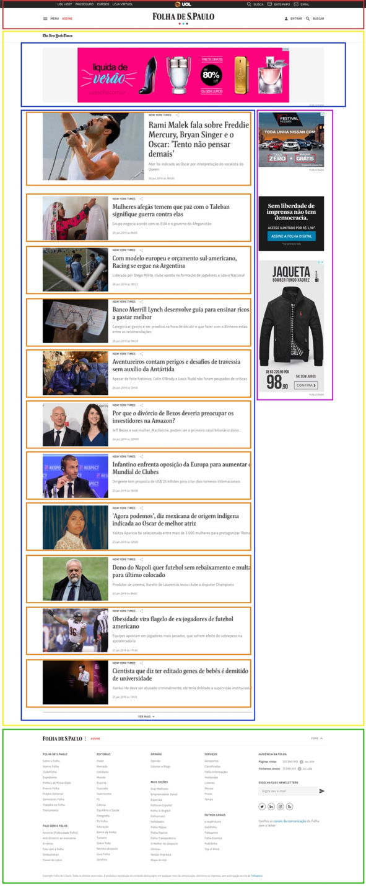
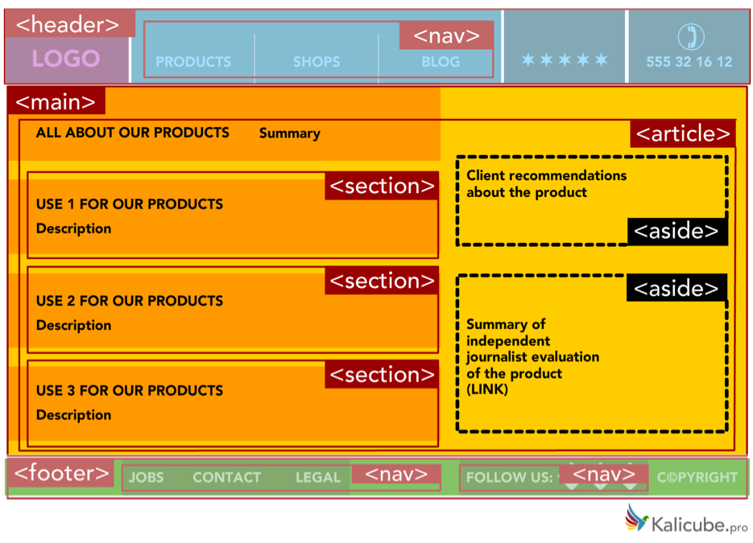

# Elementos semânticos
  
  
&nbsp;
  
  
Encontramos milhares de páginas Web, cheias de efeitos visuais e com diferentes estilos. Porém, todas elas compartilham (ou pelo menos deveriam compartilhar) a mesma estrutura de elementos HTML. O HTML 5 introduziu o conceito de elementos semânticos que estruturam uma página Web como se fosse um jornal.
  
  

  
  
&nbsp;
  
  
Repare que segue a mesma estrutura.

  
  
Nas versões anteriores ao HTML 5 toda estrutura das páginas web eram divididas utilizando o elemento \<div\>. O HTML 5 introduziu elementos específicos para corrigir de forma clara o papel desempenhado por cada elemento. Essas informações explícitas ajudam os robôs do Google e o Bing, a entender melhor qual conteúdo é importante e qual é secundário.
  
  
&nbsp;
  
  
### Header:

A parte do topo em vermelho da imagem anterior é o \<header\>, é uma área nobre do site, pois, é à primeira vista pelo usuário. Geralmente são colocados cabeçalhos, logos e menus. 
Ele pode indicar o inicio de um documento HTML ou de uma sessão.

```html
<!-- Início da página -->
<header>
    <nav>
        <ul>
            <li><a href="#">Item 1</a></li>
            <li><a href="#">Item 2</a></li>
        </ul>
    </nav>
</header>
```

```html
<!-- Início da sessão -->
<article>
     <section>
          <header>
                <h1>Cabeçalho do meu artigo</h1>
          </header>
                <p>
                    Lorem ipsum …
                </p>
     </section>
</article>
```
  
  
&nbsp;
  
  
### Navigation bar:

O \<nav\> são links de navegação do site que pode direcionar o usuário para páginas específicas dentro do site, para sessões dentro da própria página ou para sites externos.

```html
<nav>
    <ul>
        <li><a href="#">Item 1</a></li>
        <li><a href="#">Item 2</a></li>
    </ul>
</nav>
```
  
  
&nbsp;
  
  
### Main:

A parte amarela do site é o \<main\> é uma grande área central onde a maior parte do conteúdo principal do site fica alocado. Podemos ter vídeos, imagens, textos, gráficos, etc. 

```html
<main>
    <article>
        <section>
            <header>
                <h1>Cabeçalho do meu artigo</h1>
            </header>
            <p>
                Lorem …
            </p>
        </section>
    </article>
</main>
```
  
  
&nbsp;
  
  
### Side bar:

Colocamos aqui um conteúdo secundário, muitos sites utilizam o \<aside\> para mostrar propagandas aos visitantes, que é o caso do site que vimos anteriormente. Mas pode se tratar de uma notícia secundária, ou um perfil de alguém que escreveu a própria notícia.

```html
<aside>
    
</aside>
```
  
  
&nbsp;
  
  
### Footer:

Localizado na parte inferior do site ou da sessão, o objetivo do \<footer\> é mostrar os dados sobre o autor da página ou artigo, termos de copyright, contatos, endereços, etc. 

```html
<!-- Final da página -->
<footer>
    <p>Contato: (11) 912349567</p>  
</footer>
```

```html
<!--Final da sessão-->
<section>
    <header>
        <h1>Cabeçalho do meu artigo</h1>
    </header>
    <p>
        Lorem ipsum dolor sit amet consectetur adipisicing elit. Iste nisi laudantium incidunt porro dignissimos, odio deleniti molestiae, dolore maiores sit accusantium ipsam, at id ad? Alias enim sunt excepturi culpa?
    </p>
    <footer>
        <p>Autor: Fulano de Tal</p>
    </footer>
</section>
```
  
  
&nbsp;
  
  
O exemplo abaixo mostra como seria a estrutura de um website simples. 
  
  

  
  
&nbsp;
  
  
Reparem que além dos elementos semânticos que falamos agora a pouco, nesta imagem temos também o \<article\> e o \<section\>. Eles substituíram as \<div\> e servem para delimitar as diferentes partes do site, assim como um jornal pode conter diversos artigos cada artigo é dividido em sessões o mesmo conceito se aplicas às páginas web.

  
  
&nbsp;
  
  
### Article:

O \<article\> representa um bloco de conteúdo. Pode representar um post em um blog, um artigo em uma revista eletrônica, um comentário em um fórum, etc.

```html
<article>
    <section>
        <header>
            <h1>Cabeçalho do meu artigo</h1>
        </header>
        <p>
            Lorem ipsum dolor sit amet consectetur adipisicing elit. Iste nisi laudantium incidunt porro dignissimos, odio deleniti molestiae, dolore maiores sit accusantium ipsam, at id ad? Alias enim sunt excepturi culpa?
        </p>
        <footer>
            <p>Autor: Fulano de Tal</p>
        </footer>
    </section>
</article>
```
  
  
&nbsp;
  
  
### Section:

Serve para agrupar uma parte do conteúdo, como por exemplo manchetes, posts ou resumos. É uma boa prática começar cada sessão com um título, observe que também é possível dividir um \<article\> em pequenas \<section\>s para organizar melhor o conteúdo.
Existe uma dúvida que muitas pessoas têm com relação ao uso do \<article\> e do \<section\>, quem vai dentro de quem, “posso colocar um article dentro de um section? E vice versa”. A resposta é bem simples, há casos em que você terá que colocar um article dentro de um section e a há outros momentos que você usará um section dentro de um article. Não existe uma regra.

```html
<section>
    <header>
        <h2>Outro cabeçalho</h2>
    </header>
    <p>
        Lorem ipsum dolor sit amet consectetur adipisicing elit. Aliquid consequuntur tempora fuga dolores aut minima ea asperiores commodi, aspernatur possimus repellendus perspiciatis. Numquam ab, eligendi beatae ullam nostrum sapiente facere.
    </p>
    <aside>
        
    </aside>
</section>
```
  
  
&nbsp;
  
  
## Por que devemos usar elementos semânticos?
Com as versões anteriores ao HTML 5 era muito comum os Web Designer criarem classes para identificar o tipo de conteúdo da página, ex: 
Por quê? A resposta é simples!
É muito fácil identificar de forma visual as partes de um site, o cabeçalho, menus e conteúdo principal. Agora imagine que você é um deficiente visual, como faria para saber como o site está dividido?
Os spiders (robôs de navegação) do Google e do Bing por exemplo também são cegos e não conseguem distinguir o que é o cabeçalho e o rodapé do site. Com os elementos semânticos você pode dar instruções bem específicas a eles de qual é a parte mais importante do site.
  
  

  
  
&nbsp;
  
  
Com as versões anteriores ao HTML 5 era muito comum os Web Designer criarem classes para identificar o tipo de conteúdo da página, ex: 

```html
<div class="footer">
    Conteúdo da div aqui
</div>
```
  
  
Isso acabou sendo melhorado a partir do HTML 5, porque foram introduzidos os elementos semânticos que melhoram a legibilidade do código.

```html
<footer>
    <p>Autor: Fulano de Tal</p>
    <address>Rua das Flores, 10</address>
    <p>Contato: fulano@email.com</p>
</footer>
```
  
  
Veja como seria esta estrutura em código HMTL.

```html
<!DOCTYPE html>
<html lang="en">
<head>
    <meta charset="UTF-8">
    <title>Página em HTML</title>
</head>
<body>
    <header>
        <nav>
            <ul>
                <li><a href="#">Item 1</a></li>
                <li><a href="#">Item 2</a></li>
            </ul>
        </nav>
        <h1>Cabeçalho importante da página</h1>
    </header>
    <main>
        <article>
            <section>
                <header>
                    <h2>Cabeçalho do meu artigo</h2>
                </header>
                <p>Lorem ipsum…</p>
                <footer>
                    <p>Autor: Fulano de Tal</p>
                </footer>
            </section>
        </article>

        <section>
            <header>
                <h2>Outro cabeçalho</h2>
            </header>
            <p>Lorem ipsum …</p>
            <aside>
                
            </aside>
        </section>
    </main>
    <footer>
        <p>Autor: Fulano de Tal</p>
        <p>Contato: fulano@email.com</p>
    </footer>
</body>
</html>
```
  
  
&nbsp;
  
  
As vezes pode ocorrer situações onde não será possível utilizarmos elementos semânticos para agrupar o conteúdo da página, neste caso podemos utilizar os elementos \<div\> e \<span\>.

```html
<section>
    <header>
        <h2>Cabeçalho</h2>
    </header>
    <div>
        <p>
            Lorem ipsum …
        </p>
        
    </div>
</section>
```
  
  
Outros elementos semânticos
  
  
| Elemento                                                             | O que faz |
|----------------------------------------------------------------------|-----------|
| <details>                                                            | Define detalhes adicionais que podem ser exibidos ou ocultados. |
| <figcaption>                                                         | Define uma legenda para uma imagem, usado somente com a tag <figure> | 
| <figure>                                                             | Define ilustrações, diagramas, fotos, etc           |
| <mark>                                                               | Deixa um texto marcado de amarelo                   | 
| <summary>                                                            | Define um cabeçalho visível para o elemento <details>|
| <time>                                                               | Define data e hora |
  
  
&nbsp;
  
  
[< Retornar à página principal](../README.md)
  
  
[Ir para a próxima página >](16-Um-pouco-mais-de-HTML.md)
