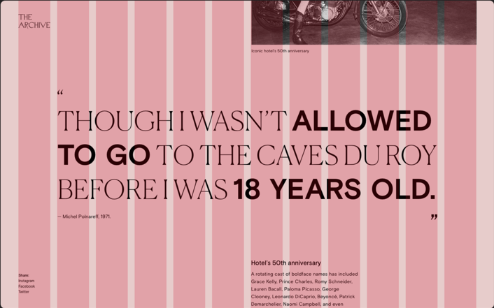

# O que é um View Port?

O Viewport é a área visível para o usuário, ou seja, a janela do navegador onde o site será mostrado. A largura do viewport pode variar de acordo com o dispositivo, telas de smartphones são menores do que telas de desktops. Antes do surgimento dos smartphones, as páginas web eram apresentadas somente em desktops (computadores) então era muito comum desenvolver o site com tamanhos fixos (px), hoje, não sabemos como o site será acessado, se utilizarmos valores fixos o usuário de um smartphone pode ser prejudicado ao visualizar o site.
A maioria dos navegadores hoje, aplicam o que chamamos de zoon out na página, ou seja, uma página que não é responsiva é reduzida até que o conteúdo caiba na tela. Isso está longe do ideal!
  
  
&nbsp;
  
  

  
  
&nbsp;
  
  
Para informarmos aos navegadores que a nossa página é uma página responsiva, nós utilizamos o elemento \<meta name="viewport" content="width=device-width, initial-scale=1.0"\>, nós falamos um pouco sobre o elemento viewport no capítulo anterior.
Mas agora vamos entender o seu funcionamento em detalhes.

O simples fato de inserirmos o atributo viewport em uma página, já muda completamente a forma como ela é exibida em um dispositivo mobile.
  
  
&nbsp;
  
  

  
  
&nbsp;
  
  
O atributo name=”viewport” permite controlar as dimensões da página, content="width=device-width” que fala para o navegador que a largura da página será a largura da tela do dispositivo. E initial-scale=1.0" indica o zoom inicial quando a página for carregada pelo navegador.
Por não sabermos como nem onde as páginas serão acessadas, nós trabalhamos com valores relativos ( % ).

  
  
&nbsp;
  
  
## Sistema de Grid
  
  
&nbsp;
  
  
Muitas páginas se baseiam no sistema de grid, basicamente ele divide a página web em linhas e colunas, como uma tabela do Excel. Por padrão as páginas são divididas em 12 colunas, se eu quiser que um menu ocupe 100% da largura da tela, eu falo para o navegador que ele ocupará 12 colunas, se eu quiser que ele ocupe metade da tela, serão 6 colunas, e assim por diante.
  
  

  
  
&nbsp;
  
  
[< Retornar à página principal](../README.md)
  
  
[Ir para a próxima página >](19-Construindo-um-sistema-de-grid.md)

