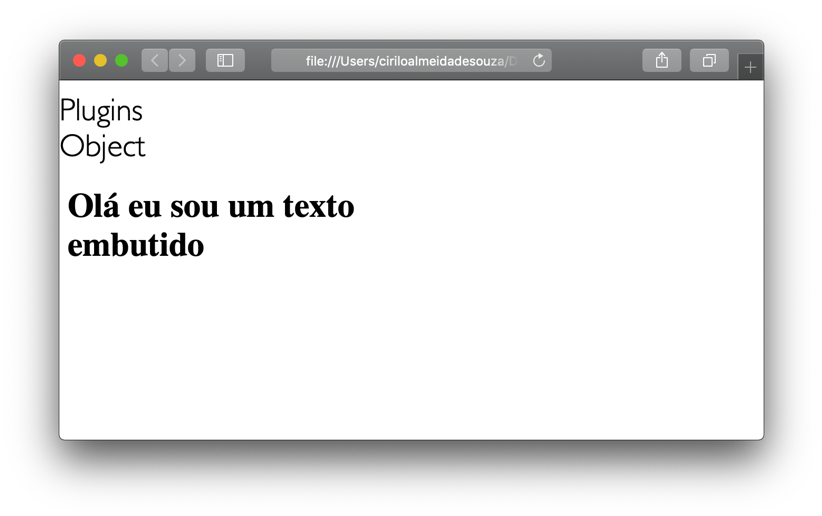
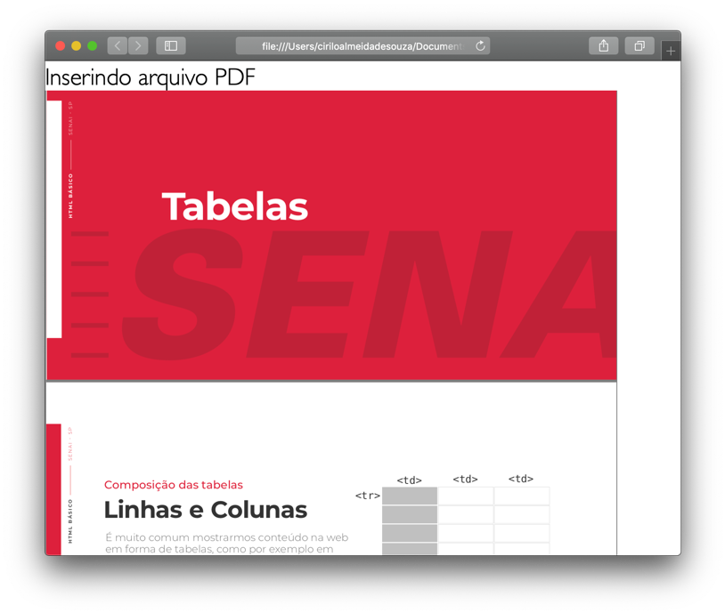

# Multimídia
  
  
&nbsp;
  
  
Multimídia é um termo que esteve em alta em 2018, muitas faculdades e também o mercado de trabalho voltaram os olhos para os produtores de conteúdo. Hoje ser “youtuber ou blogueiro” se tornaram uma profissão e saber manusear conteúdo de áudio e vídeo é um diferencial para qualquer profissional da área de web. 
O termo **multimídia** significa tudo que você consegue ver e ouvir em uma página, ou seja, vídeos, imagens, animações e áudio são elementos multimídia

  
  
&nbsp;
  
  
## Formatos da mídia suportados
  
  
&nbsp;
  
  
| Formato         | Descrição                                                                  |
|-----------------|----------------------------------------------------------------------------|
| .ogg            | Formato de áudio e vídeo desenvolvido pela Xing.org e suportado pelo HTML5 |
| .WebM           | Desenvolvido através de uma parceria entre Mozilla, Opera, Adobe e Google  |
| .MPEG-4 ou .MP4 | Formato de áudio e vídeo desenvolvido pela Moving Pictures Expert Group    |
| .MP3            | Antecessor do MP4 também suportado pelo HTML5                              |
| .WAV            | Desenvolvido pela Microsoft e suportado pelo HTML 5                        |
  
  
&nbsp;
  
  
## Adicionando vídeos à página Web
  
  
&nbsp;
  
  
Utilizamos o elemento \<video\> para inserirmos um vídeo na página web. Ele contém os seguintes atributos: controls, autoplay, loop, muted, poster, preload e src.

### Controls:
  
Este é um comando booleando, significa que ao ser inserido o navegador considera que seu valor é igual a true (verdadeiro) desta forma os controles padões de iniciar, parar, volume, avançar, voltar e legendas serão mostrados no navegador. Se for omitido eles não serão mostrados.

### Autoplay:

Também é um atributo booleano, se estiver presente o vídeo iniciará automaticamente após ser carregado na página.
  
  
### Loop:
  
Também é um atributo booleano, quando presente indica que o vídeo deve iniciar novamente após o seu término de forma infinita.
Muted:
Também é um atributo booleano que indica que o vídeo não emitirá áudio.
  
  
### Poster:
  
Este atributo mostrará uma imagem enquanto o vídeo é baixado ou até que o usuário inicie ele pressionando o botão de play.
  
  
### Preload:
  
Este atributo indica ao navegador SE e COMO o vídeo deve ser carregado na página, ele possui três valores, auto (carrega o vídeo inteiro quando a página for carregada), metadata (carrega somente os metadados do vídeo quando a página é carregada) e none (não carrega o vídeo quando a página é carregada).
  
  
### Src:
  
Este é um atributo padrão usado por vários elementos HTML, ele define um caminho de origem onde o arquivo será mostrado na página web.
ra inserirmos um vídeo na página web. Ele contém os seguintes atributos: controls, autoplay, loop, muted, poster, preload e src.
  
  
### Controls:
  
Este é um comando booleando, significa que ao ser inserido o navegador considera que seu valor é igual a true (verdadeiro) desta forma os controles padões de iniciar, parar, volume, avançar, voltar e legendas serão mostrados no navegador. Se for omitido eles não serão mostrados.
  
  
### Autoplay:
  
Também é um atributo booleano, se estiver presente o vídeo iniciará automaticamente após ser carregado na página.
  
  
### Loop:
  
Também é um atributo booleano, quando presente indica que o vídeo deve iniciar novamente após o seu término de forma infinita.
Muted:
Também é um atributo booleano que indica que o vídeo não emitirá áudio.
  
  
### Poster:
  
Este atributo mostrará uma imagem enquanto o vídeo é baixado ou até que o usuário inicie ele pressionando o botão de play.
  
  
### Preload:
  
Este atributo indica ao navegador SE e COMO o vídeo deve ser carregado na página, ele possui três valores, auto (carrega o vídeo inteiro quando a página for carregada), metadata (carrega somente os metadados do vídeo quando a página é carregada) e none (não carrega o vídeo quando a página é carregada).
  
  
### Src:
   
Este é um atributo padrão usado por vários elementos HTML, ele define um caminho de origem onde o arquivo será mostrado na página web.

  
```html
    <video src="toy-story.mp4" controls autoplay poster="toy-story.jpg"></video>
```
  
  
&nbsp;
  
  
## Carregando vídeos alternativos
  
  
&nbsp;
  
  
Um navegador antigo pode não suportar um determinado formato de vídeo, para corrigir esse problema usamos a tag \<source\> que nos permite carregar vídeos em vários formatos. Caso um navegador não suporte um formato ele irá para o próximo e assim por diante.
  
  
```html
    <video controls autoplay>
         <source src="toy-story.mp4" type="video/mp4" srcset="toy-story.jpg">
         <source src="toy-story.ogg" type="video/ogg" srcset="toy-story.jpg">
    </video>
```

  
  
&nbsp;
  
  
O elemento \<track\>, permite carregarmos um arquivo de legendas, ou um texto que deve aparecer enquanto o vídeo está em execução.
Ele possui quatro atributos padrões, src, kind, srclang e label.
  
  
### Src:
  
Este é um atributo padrão usado por vários elementos HTML, ele define um caminho de origem onde o arquivo será mostrado na página web.
  
  
### Kind:
   
Determina o tipo do arquivo que será carregado, se de legendas (subtites),  descrição (description), metada ou etiquetas (caption) 
  
  
### Srclang:
  
Determina a linguagem na qual o arquivo está escrito.
  
  
### Label:
  
Especifica um título para a legenda.
  
  
```html
<video controls autoplay id="video">
      <source src="./public/video/toy-story.mp4" type="video/mp4" srcset="./public/images/toy-story.jpg">
      <source src="./public/video/toy-story.ogg" type="video/ogg" srcset="./public/images/toy-story.jpg">
      <track src="./public/video/teste.vtt" kind="subtitles" srclang="pt-br" label="Português">
</video>
```
  
  
&nbsp;
  
  
## Adicionando áudio a página Web
  
  
&nbsp;
  
  
Utilizamos o elemento <audio> para inserir um arquivo de áudio à página Web. Da mesma forma que o elemento \<video\>, o \<audio\> possui os mesmos atributos, como, \<source\>,  tags para carregar vídeos alternativos, etc.
  
```html
    <audio controls autoplay loop>
         <source src="./public/audio/teste.mp3">
    </audio>
```
  
  
&nbsp;
  
  
## Adicionando plug-ins a página Web
  
  
&nbsp;
  
  
Os plug-ins são aplicações desenvolvidas por terceiros que estendem as funcionalidades padão da página, permitindo inserir elementos externos a ela. Esses elementos podem ser imagens, vídeos, ou até mesmo outras páginas web.

Como assim… uma página web dentro de outra? Isso mesmo jovem Padawan!

Nós fazemos isso através dos elementos \<object\> e \<embed\> respectivamente. O \<object\> é suportado por todas as versões de navegadores, já o \<embed\> pode não ser suportado por todos, neste caso verifique a compatibilidade antes de usar.

  
  
&nbsp;
  
  
### Object:
  
O \<object\> é um elemento de bloco e pode ser estilizado como qualquer outro, ele possui o atributo data, no qual especificamos o conteúdo que será carregado na página. Ele é muito usado para inserir leitores de arquivos PDF, outras páginas Web, áudio, imagens, etc. (apesar de poder ser usado para inserir imagens ou áudio, não recomendo porque existem tags específicas para tal fim).

Neste caso, vamos inserir uma página Web, criamos uma página simples chamanda embed.html, esta página foi inserida tanto no elemento \<object\> quanto no \<embed\>.
  
  
&nbsp;
  
  
```html
    <section class="containe">
        <section class="row">
            <header class="col-12">
                <h2>Plugins</h2>
            </header>
            <section class="col-6">
                <header>
                    <h2>Object</h2>
                </header>
                <object data="./embed.html"></object>
            </section>
        </section>
    </section>
```
  
  
&nbsp;
  
  

  
  
&nbsp;
  
  
### Embed:
  
O \<embed\> é muito semelhante ao \<object\>, porém foi criado na especificação HTML5, não sendo suportado anteriormente.  O \<embed\> é uma tag vazia, ela não necessita da tag de fechamento (falamos sobre as tags vazias no capítulo HTML Básico).
Vamos inserir um arquivo PDF à nossa página.

  
  
&nbsp;
  
  
```html
    <section class="col-12 margin">
        <header>
            <h2>Inserindo arquivo PDF</h2>
        </header>
        <embed type="application/pdf" src="./public/pdf/10-tabelas.pdf">
    </section>
```
  
  

  
  
Perceba que o arquivo foi inserido e que é possível dar scroll dentro dele para ler as demais páginas do PDF.
  
  
&nbsp;
  
  
## Inserindo vídeos do Youtube
  
  
&nbsp;
  
  
Outra forma bem legal de se trabalhar com multimídia é inseir vídeos na nossa página Web, porém nem sempre temos o arquivo de vídeo, neste caso, podemos inseir um vídeo do Youtube através do elemento \<iframe\>. O \<iframe\> não serve exclusivamente para inserir vídeos do Youtube mas também para inserir páginas web. 
  
  
```html
    <section class="col-6">
        <iframe src="https://www.youtube.com/embed/cG24xi2XoRk" 
                frameborder="0" 
                allow="accelerometer; autoplay; encrypted-media; gyroscope; picture-in-picture" 
                allowfullscreen>
        </iframe>
    </section>
```
  
O HTML5 introduziu novos atributos ao \<iframe\>, para saber mais, consulte a lista no [W3Schools](https://www.w3schools.com/tags/tag_iframe.asp).
  
  
&nbsp;
  
  
[< Retornar à página principal](../README.md)
  
  
[Ir para a próxima página >](23-Efeitos-legais-com-transicao-e-animacao.md)

