# Adicionando efeitos visuais
  
  
&nbsp;
  
  
As transformações, transições e animações, permitem adicionar efeitos visuais aos elementos da página Web de forma que eles possam se movimentar na tela, ou interagir de acordo com um evento iniciado pelo usuário. Isso vai dar a nossa página Web um ar mais moderno, algo mais… “Descolado” (bem diferente das páginas estáticas). 
  
  
&nbsp;
  
  
## Transformação 2D
  
  
&nbsp;
  
  
A propriedade CSS transform, nos permite mudar a forma e a posição de um elemento. Podemos rotacioná-los, movê-los e redimensioná-los em resposta a uma ação do usuário. O elemento sai do ponto A para o ponto B, ou seja, ele pode ter um tamanho inicial diferente do final, ou uma posição inicial diferente da final.
A propriedade transform possui os seguintes métodos:
  
  
| Valor        | Para que serve                                              |
|--------------|-------------------------------------------------------------|
| translate( ) | Move um elemento nos eixos X e Y.                           |
| rotate( )    | Rotaciona um elemento no sentido horário e anti-horário.    |
| scale( )     | Aumenta ou diminui o tamanho do elemento.                   |
| skewX( )     | Inclina um elemento no eixo X.                              |
| skewY( )     | Inclina um elemento no eixo Y.                              |
| matrix()     | Combina todos os valores anterios de transform em um único. |
  
  
&nbsp;
  
  
### Translate( ):
  
O valor translate() move um elemento de acordo com os eixos X e Y.
  
  
```css
.transform:hover{
    -ms-transform: translate(50px, 50px); /* IE 9 */
    -webkit-transform: translate(50px, 50px); /* Safari */
    transform: translate(50px, 50px);
}
```
  
  
Neste caso, estamos informando ao navegador que quando o usuário passar o mouse sobre o elemento (hover) queremos movê-lo 50px para a direita e 50px para baixo. 
  
  
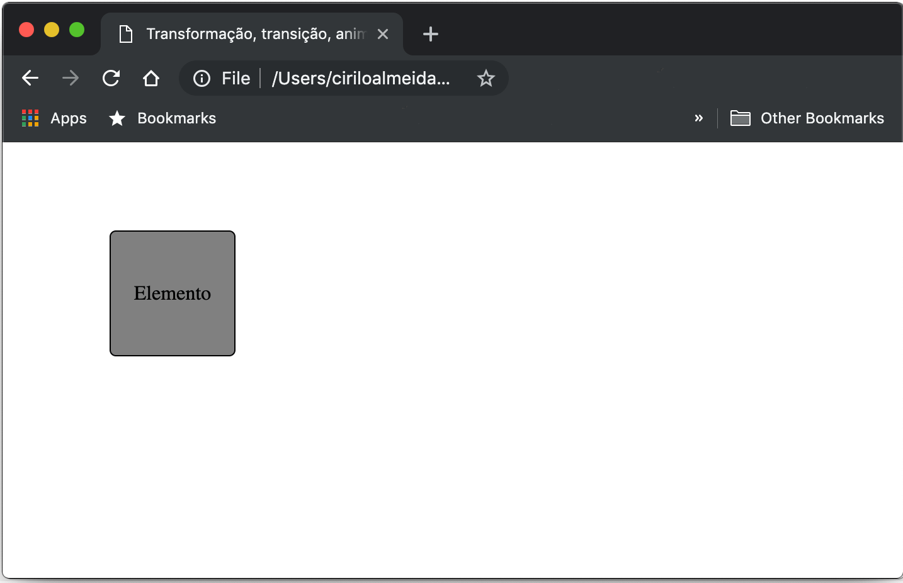

  
  
&nbsp;
  
  
### Rotate( ):
  
O valor rotate() rotaciona o elemento no sentido horário e anti-horário, dentro dos parênteses informamos o ângulo de rotação em graus. Se os graus forem negativos, o elemento será rotacionado no sentido anti-horário.
  
  
```css
.rotate{
    -ms-transform: rotate(45deg);
    -webkit-transform: rotate(45deg);
    -moz-transform: rotate(45deg);
    transform: rotate(45deg);
}
```
  
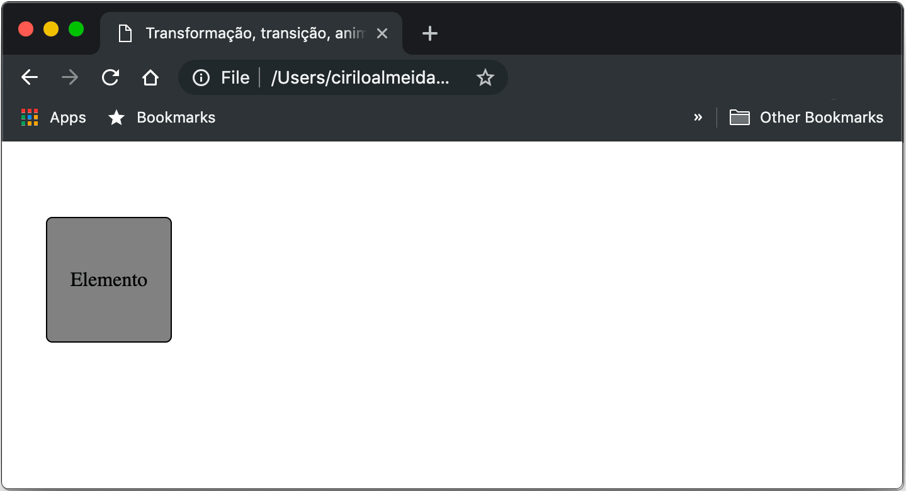
  
  
&nbsp;
  
  
### Scale( ):
  
Aumenta ou diminui um elemento de acordo com o valor das propriedades width e height. E pode receber dois valores scale(width, height), mas devemos ficar atentos porque os valores são em escala.
  
```css
.scale{
    -ms-transform: scale(2);
    -webkit-transform: scale(2);
    -moz-transform: scale(2);
    transform: scale(2);
    margin-left: 100px;
}
```

Se passarmos como valor apenas um número, a escala será aplicada tanto para a largura (width) quanto para a altura (height) de forma proporcional.
Neste caso, estamos falando para o navegador que queremos aumentar em 2 vezes o tamanho original do elemento.
  
  
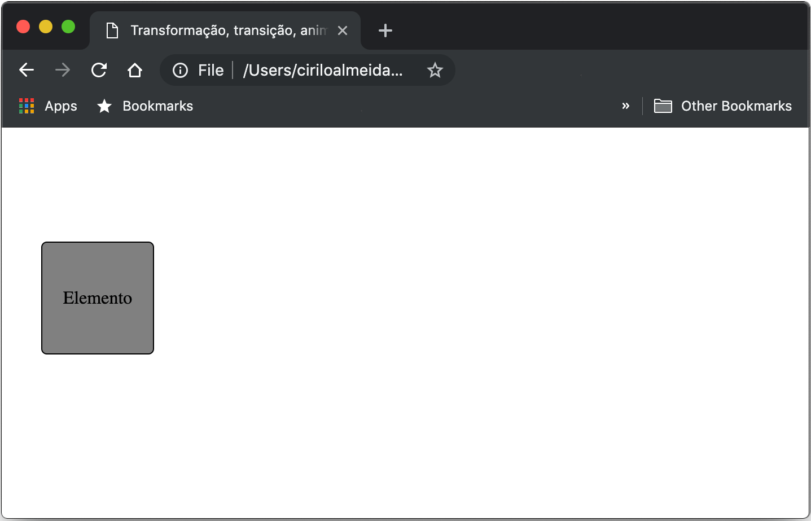
  
  
&nbsp;
  
  
Podemos informar valores diferentes para a largura e altura, neste caso o elemento não crescerá de maneira proporcional.
Repare que todo o conteúdo da também aumenta, e acaba distorcendo. Por tanto, muito cuidado quando for utilizar o scale() para que imagens, textos, etc. não fiquem distorcidos.
  
  
&nbsp;
  
  
### Skew( ):
  
O método skew(), inclina o elemento de acordo com o eixo, skewX() (inclina no eixo X) e skewY() (inclina no eixo Y). 
  
  
```css
.skew{
    -ms-transform: skew(20deg);
    -webkit-transform: skew(20deg);
    -moz-transform: skew(20deg);
    transform: skew(20deg);
    margin-left: 100px;
}

.skewX{
    -ms-transform: skewX(20deg);
    -webkit-transform: skewX(20deg);
    -moz-transform: skewX(20deg);
    transform: skewX(20deg);
    margin-left: 100px;
}

.skewY{
    -ms-transform: skewY(20deg);
    -webkit-transform: skewY(20deg);
    -moz-transform: skewY(20deg);
    transform: skewY(20deg);
    margin-left: 100px;
}
```
  
  
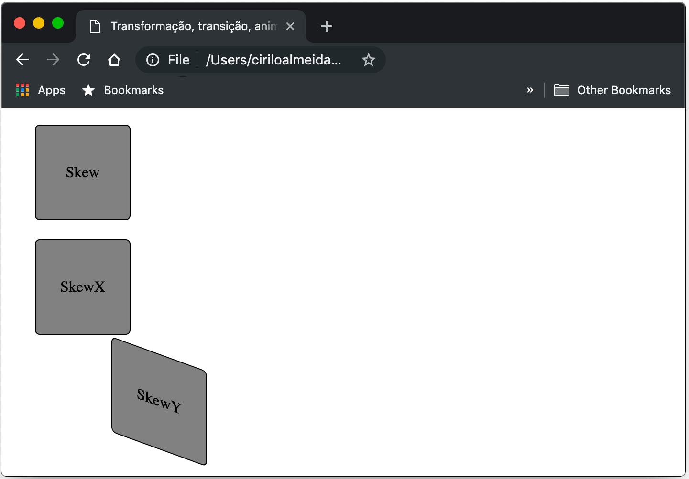
  
  
&nbsp;
  
  
### Matrix( ):
  
O método matrix() reúne todos os valores dos outros métodos citados anteriormente.  Os valores são declarados na seguinte ondem: scaleX(), skewY(), skewX(),  scaleY(), translateX() e translateY(). 

```css
.matrix{
    -ms-transform: matrix(1, 0, 0.5, 1, 150, 0);
    -webkit-transform: matrix(1, 0, 0.5, 1, 150, 0);
    -moz-transform: matrix(1, 0, 0.5, 1, 150, 0);
    transform: matrix(1, 0, 0.5, 1, 150, 0);
    margin-left: 20px;
}
```

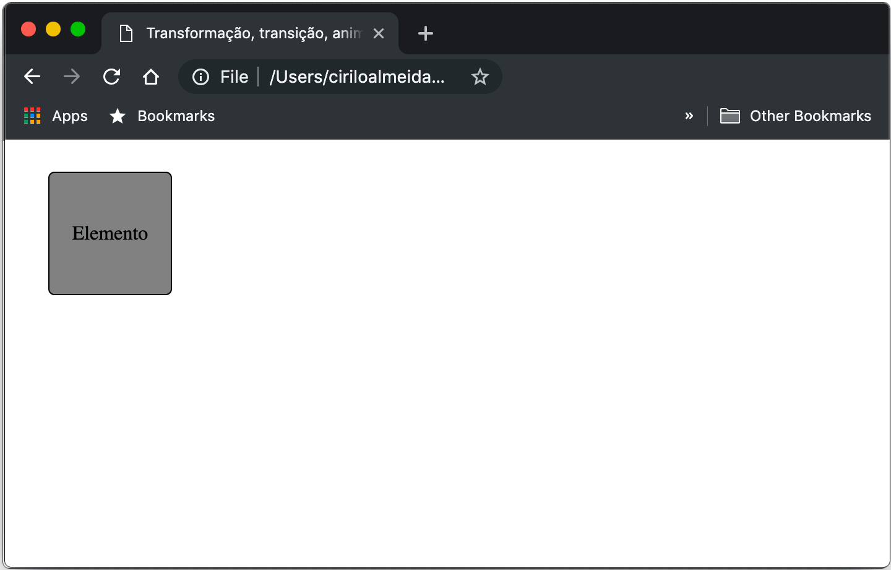
  
  
&nbsp;
  
  
## Transformação 3D
  
  
&nbsp;
  
  
Uma transformação 3D permite que você rotacione, redimensione, ou mova um elemento HTML utilizando o eixo Z. Utilizamos as mesmas funções aplicadas anteriormente para o transform 2D, como rotate, scale, translate e matrix, a única diferença é a forma como os elementos irão se comportar pois o transform 3D utiliza o eixo Z.
  
  
&nbsp;
  
  
### Rotate( ):
  
O método rotateX() rotacional o elemento de acordo com o eixo X (horizontal),  método rotateY(), rotaciona de acordo com o eixo Y (vertical) e rotateZ() no eixo Z (meio do elemento).
  
  
* **RotateX():**

```css
.rotateX:hover{
    transform: rotateX(180deg);
    -webkit-transform: rotateX(180deg);
    -ms-transform: rotateX(180deg);
    -moz-transform: rotateX(180deg);
}
```
  
  
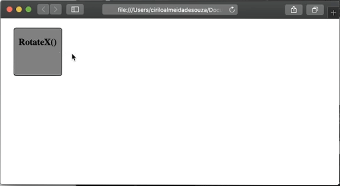
  
  
&nbsp;
  
  
* **RotateY():**
  
```css
.rotateY:hover{
    transform: rotateY(180deg);
    -webkit-transform: rotateY(180deg);
    -ms-transform: rotateY(180deg);
    -moz-transform: rotateY(180deg);
}
```

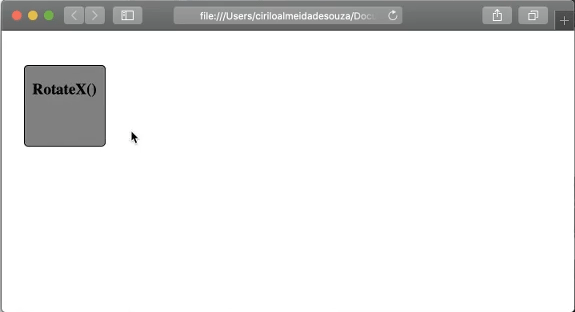
  
  
&nbsp;
  
  
* **RotateZ():**
  
```css
.rotateZ:hover{
    transform: rotateZ(45deg);
    -webkit-transform: rotateZ(45deg);
    -ms-transform: rotateZ(45deg);
    -moz-transform: rotateZ(45deg);
    transition: transform 1s;
}
```
  
  
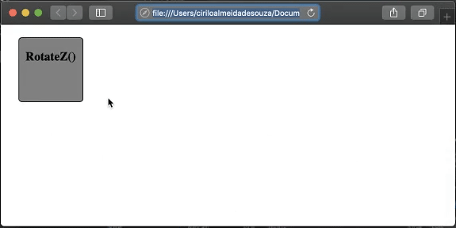
  
  
&nbsp;
  
  
### Perspective:
  
Uma perspectiva é a forma como uma pessoa enxerga um objeto em um determinado ângulo. Podemos criar objetos em perspectiva nas nossas páginas Web utilizando apenas CSS, através da propriedade perspective. Ao definirmos a propriedade perspective em um elemento, são os filhos dele que recebem os valores que permitem que sejam enxergados em perspectiva, não o elemento pai que recebeu a propriedade em si.
  
  
**HTML**
```html
<div class="perspective">
    <div class="cube">
        <div class="side front">1</div>
        <div class="side back">6</div>
        <div class="side right">4</div>
        <div class="side left">3</div>
        <div class="side top">5</div>
        <div class="side bottom">2</div>
    </div>
</div>
```

**CSS**
```css
.perspective{
    perspective: 800px;
}

.cube{
    font-size: 4em;
    width: 2em;
    margin: 1.5em auto;
    transform-style: preserve-3d;
    transform: rotateX(-45deg) rotateY(30deg);
}

.side{
    position: absolute;
    width: 2em;
    height: 2em;
    background: rgba(100,100,100,0.5);
    border: 1px solid red;
    text-align: center;
    line-height: 2em;
}

.front {transform: translateZ(1em);}
.top {transform: rotateX(90deg) translateZ(1em);}
.right {transform: rotateY(90deg) translateZ(1em);}
.left {transform: rotateY(-90deg) translateZ(1em);}
.bottom {transform: rotateX(-90deg) translateZ(1em);}
.back {transform: rotateY(-180deg) translateZ(1em);}
```
  
  
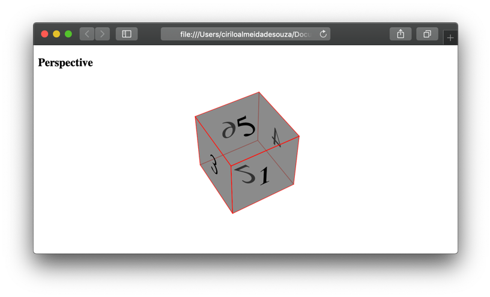
  
  
Este exemplo foi retirado do site [W3Schools](https://www.w3schools.com/cssref/css3_pr_perspective-origin.asp)
  
  
&nbsp;
  
  
## Transição
  
  
&nbsp;
  
  
A propriedade transition, adiciona uma transição suave à uma propriedade CSS, podemos adicionar uma transição a qualquer propriedade CSS, não somente quando utilizamos o transform.
O transition recebe apenas dois valores, a propriedade que queremos adicionar uma transição suave e o tempo que essa transição irá durar.

```css
.translate:hover{
    transform: translate(500px);
    transition: transform 5s;
}
```
  
  
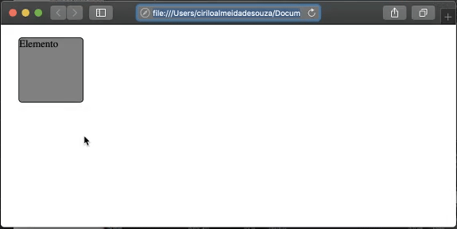
  
  
Neste caso o elemento levará cinco segundos para concluir a transição. Por padrão a transição será linear, ou seja, terá a mesma velocidade do início até o fim.
  
  
&nbsp;
  
  
### Curva da transição:
  
A curva de transição defina a velocidade na qual a transição será executada, se omitida, por padrão a propriedade transition-timing-function receberá o valor linear. Acredito que a compreensão do que cada valor da propriedade transition-timing-function faz efetivamente seja mais fácil em forma de gráfico, por isso, mostrarei primeiro o gráfico e logo após o CSS.
  
  
&nbsp;
  
  
<style type="text/css">
.image-left {
  display: block;
  float: right;
}
</style>

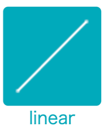{: .image-left } Terá uma velocidade constante do início até o final da transição. 

```css
.translate:hover{
    transform: translate(500px);
    transition: transform 6s;
    transition-timing-function: linear;
}
```
  
  
&nbsp;
  
  
[< Retornar à página principal](../README.md)
  
  
[Ir para a próxima página >]()
