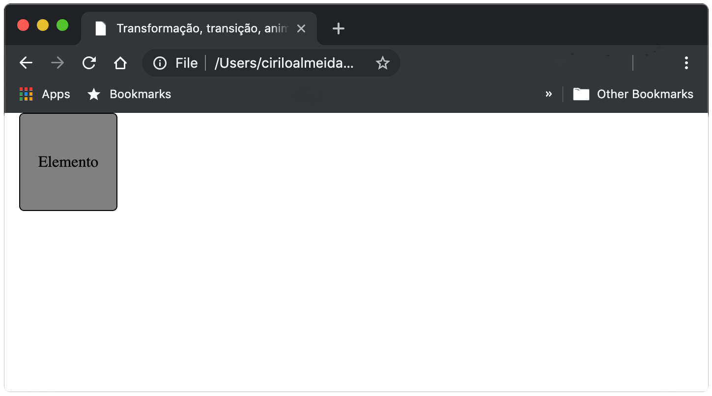

# Adicionando efeitos visuais
  
  
&nbsp;
  
  
As transformações, transições e animações, permitem adicionar efeitos visuais aos elementos da página Web de forma que eles possam se movimentar na tela, ou interagir de acordo com um evento iniciado pelo usuário. Isso vai dar a nossa página Web um ar mais moderno, algo mais… “Descolado” (bem diferente das páginas estáticas). 
  
  
&nbsp;
  
  
## Transformação 2D
  
  
&nbsp;
  
  
A propriedade CSS transform, nos permite mudar a forma e a posição de um elemento. Podemos rotacioná-los, movê-los e redimensioná-los em resposta a uma ação do usuário. O elemento sai do ponto A para o ponto B, ou seja, ele pode ter um tamanho inicial diferente do final, ou uma posição inicial diferente da final.
A propriedade transform possui os seguintes métodos:
  
  
| Valor        | Para que serve                                              |
|--------------|-------------------------------------------------------------|
| translate( ) | Move um elemento nos eixos X e Y.                           |
| rotate( )    | Rotaciona um elemento no sentido horário e anti-horário.    |
| scale( )     | Aumenta ou diminui o tamanho do elemento.                   |
| skewX( )     | Inclina um elemento no eixo X.                              |
| skewY( )     | Inclina um elemento no eixo Y.                              |
| matrix()     | Combina todos os valores anterios de transform em um único. |
  
  
&nbsp;
  
  
### Translate( ):
  
O valor translate() move um elemento de acordo com os eixos X e Y.
  
  
```css
.transform:hover{
    -ms-transform: translate(50px, 50px); /* IE 9 */
    -webkit-transform: translate(50px, 50px); /* Safari */
    transform: translate(50px, 50px);
}
```
  
  
Neste caso, estamos informando ao navegador que quando o usuário passar o mouse sobre o elemento (hover) queremos movê-lo 50px para a direita e 50px para baixo. 
  
  


  
  
&nbsp;
  
  
### Rotate( ):
  
O valor rotate() rotaciona o elemento no sentido horário e anti-horário, dentro dos parênteses informamos o ângulo de rotação em graus. Se os graus forem negativos, o elemento será rotacionado no sentido anti-horário.
  
  
```css
.rotate{
    -ms-transform: rotate(45deg);
    -webkit-transform: rotate(45deg);
    -moz-transform: rotate(45deg);
    transform: rotate(45deg);
}
```
  

  
  
&nbsp;
  
  
### Scale( ):
  
Aumenta ou diminui um elemento de acordo com o valor das propriedades width e height. E pode receber dois valores scale(width, height), mas devemos ficar atentos porque os valores são em escala.
  
```css
.scale{
    -ms-transform: scale(2);
    -webkit-transform: scale(2);
    -moz-transform: scale(2);
    transform: scale(2);
    margin-left: 100px;
}
```

Se passarmos como valor apenas um número, a escala será aplicada tanto para a largura (width) quanto para a altura (height) de forma proporcional.
Neste caso, estamos falando para o navegador que queremos aumentar em 2 vezes o tamanho original do elemento.
  
  

  
  
&nbsp;
  
  
Podemos informar valores diferentes para a largura e altura, neste caso o elemento não crescerá de maneira proporcional.
Repare que todo o conteúdo da também aumenta, e acaba distorcendo. Por tanto, muito cuidado quando for utilizar o scale() para que imagens, textos, etc. não fiquem distorcidos.
  
  
&nbsp;
  
  
### Skew( ):
  
O método skew(), inclina o elemento de acordo com o eixo, skewX() (inclina no eixo X) e skewY() (inclina no eixo Y). 
  
  
```css
.skew{
    -ms-transform: skew(20deg);
    -webkit-transform: skew(20deg);
    -moz-transform: skew(20deg);
    transform: skew(20deg);
    margin-left: 100px;
}

.skewX{
    -ms-transform: skewX(20deg);
    -webkit-transform: skewX(20deg);
    -moz-transform: skewX(20deg);
    transform: skewX(20deg);
    margin-left: 100px;
}

.skewY{
    -ms-transform: skewY(20deg);
    -webkit-transform: skewY(20deg);
    -moz-transform: skewY(20deg);
    transform: skewY(20deg);
    margin-left: 100px;
}
```
  
  

  
  
&nbsp;
  
  
### Matrix( ):
  
O método matrix() reúne todos os valores dos outros métodos citados anteriormente.  Os valores são declarados na seguinte ondem: scaleX(), skewY(), skewX(),  scaleY(), translateX() e translateY(). 

```css
.matrix{
    -ms-transform: matrix(1, 0, 0.5, 1, 150, 0);
    -webkit-transform: matrix(1, 0, 0.5, 1, 150, 0);
    -moz-transform: matrix(1, 0, 0.5, 1, 150, 0);
    transform: matrix(1, 0, 0.5, 1, 150, 0);
    margin-left: 20px;
}
```


  
  
&nbsp;
  
  
[< Retornar à página principal](../README.md)
  
  
[Ir para a próxima página >]()
