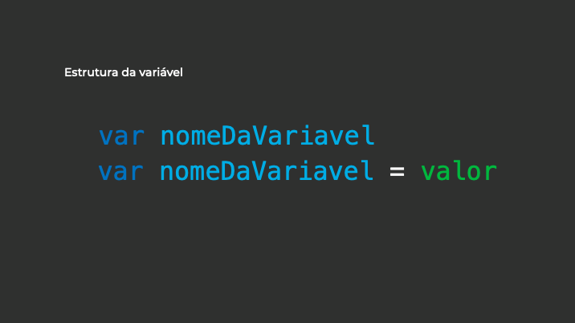
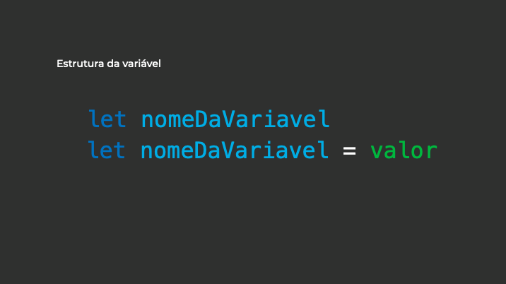

# O que são variáveis?
  
  
&nbsp;
  
  
A parte mais básica de qualquer linguagem de programação que podemos aprender são as variáveis. O conceito é basicamente o mesmo para todas as linguagens o que facilita a aprendizagem, as variáveis têm este nome porque podem armazenar dados variáveis, ou seja, seu conteúdo pode mudar com o passar do tempo.
Mas que tipo de dados podemos armazenar? 
Podemos armazenar textos, números, listas, objetos ou até mesmo outras variáveis. O que vai mudar de uma linguagem de programação para outra é a forma como declaramos isso no nosso código.

No caso do JavaScript, para declararmos uma variável podemos utilizar as palavras reservadas **var** ou **let** seguidas pelo nome da variável e logo após o seu valor.
  
  

  

  
  
&nbsp;
  
  
## Declarando variáveis
  
  
&nbsp;
  
  
As variáveis devem ser identificadas com nomes que descrevam a sua utilização, não é incomum encontrarmos códigos JavaScript com nomes de variáveis como: Sabiá, Papagaio, Sol, Lua, Skywalker, etc. São nomes legais, mas a menos que a nossa página se trate de pássaros, universo ou Star Wars eles fazem sentido e podem ser usados, caso não se trate de nenhum desses casos, deixe a criatividade de lado e identifique as variáveis com nomes que façam sentido no contexto em que elas serão usadas. 
  
  
Podemos declarar variáveis de três formas:
  
*	Variáveis globais: 
  
Declaramos o nome da variável e o valor ex: ***numero = 42*** ou ***var numero = 42***, esta variável se torna acessível em qualquer parte da aplicação. Não é recomendado criarmos variáveis globais sem que haja um motivo para isso.
  
  
*	Variáveis locais:
  
Funcionam somente no escopo na qual foram criadas, não sendo acessíveis de outras partes do código (*vamos falar sobre isso daqui a pouco!*). São criadas com a utilização do ***let***.
Os nomes das variáveis devem iniciar com letras, números, underline ou cifrão (dólar), os caracteres subsequentes também podem conter números de **[0-9]** ou letras **[a-z, A-Z]**. 
  
  
**JS**

```javascript
// O Javascript aceita números como nome de variáveis
var camisa9 = "Ronaldo";
let camisa9QuemE = "Ronaldo";

// O javascript aceita $(cifrão) e _(underline)
let $meuNome = "Cirilo";
let sobre_nome = "Souza";

// Podemos declarar variáveis na mesma linha separadas por vírgulas
let nome = "Cirilo", carro = "Fox", idade = 34;
```
  
  
&nbsp;
  
  
O JavaScript é case sensitive, ou seja, ele é sensível a letras maiúsculas e minúsculas. Para ele ***meuNome*** é totalmente diferente de ***meunome*** ou ***MeuNome***. Por tanto, para evitar problemas procure sempre seguir o mesmo padrão durante o desenvolvimento dos seus códigos JS.

```javascript
// O Javascript é Case Sensitive 
let meunome = "Cirilo"; 
let MeuNome = "Cirilo"; 
let meuNome = "Cirilo"; 
```
  
  
&nbsp;
  
  
## Palavras reservadas
  
  
&nbsp;
  
  
Não podemos dar qualquer nome às variáveis, existem algumas palavras que são reservadas pela linguagem e não podem ser usadas. São elas:
  
| abstract     | boolean   | Break      |
| Byte         | Case      | Catch      |
| Continue     | Default   | Do         |
| Double       | Else      | Extends    |
| FALSE        | Final     | Finally    |
| Float        | For       | Function   |
| Goto         | If        | Implements |
| import       | in        | instanceof |
| int          | Interface | Long       |
| native       | New       | Null       |
| Packge       | Private   | Protect    |
| Public       | Return    | Short      |
| Static       | Super     | Switch     |
| Synchronized | This      | Throw      |
| Transit      | TRUE      | Try        |
| Var          | Void      | While      |
| with         |           |            |

  
  
&nbsp;
  
  
[< Retornar à página principal](../README.md)
  
  
[Ir para a próxima página >](26-Operadores.md)
