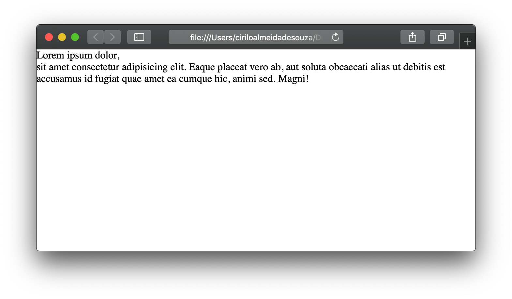
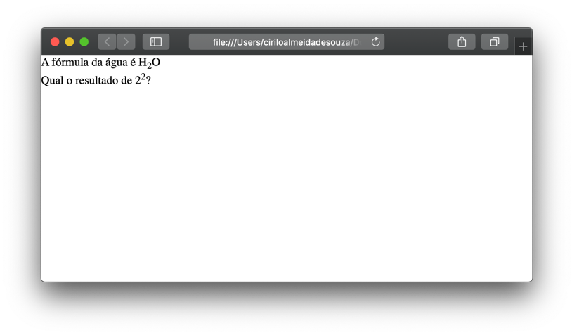
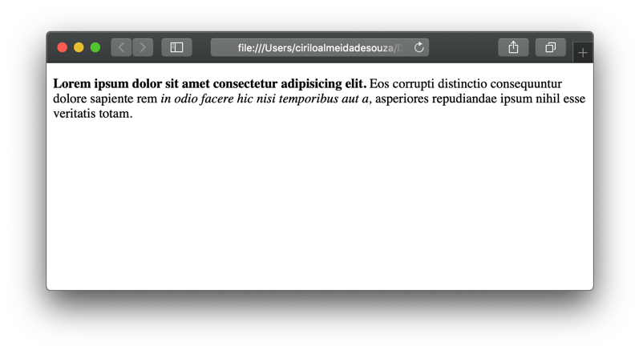
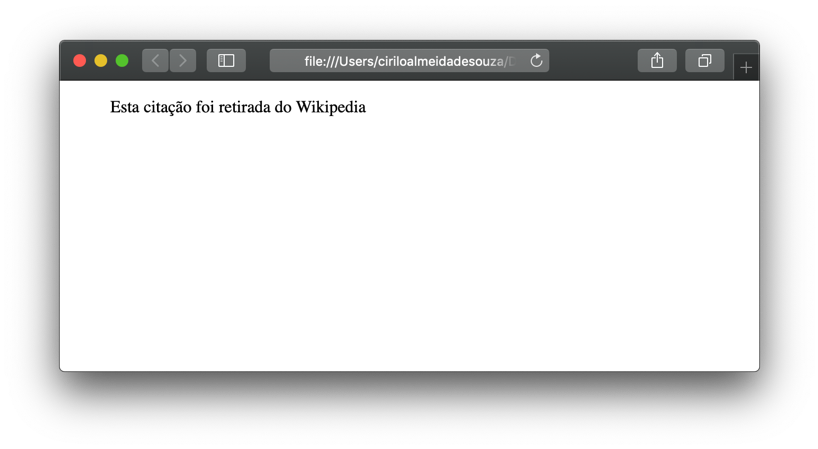

# Trabalhando com texto
  
  
&nbsp;
  
Quando criamos páginas Web nós adicionamos tags que são chamadas de elementos, esses **elementos** informam ao navegador o que deve ser exibido e como será exibido na tela. 
Nesta sessão, vamos ver em detalhes os elementos que são usados para inserir texto em páginas HTML. Estes elementos são divididos em duas partes, os **estruturais** e os **semânticos**, os estruturais servem para criar textos, como cabeçalhos e parágrafos já os semânticos provêm informações extras como dar ênfase ao texto. 
  
  
&nbsp;
  
## Cabeçalho:
O cabeçalho possui seis níveis, iniciando pelo \<h1\> e finalizando no \<h6\> sendo o \<h1\> utilizado para o título principal, por isso deve ser único e os demais podem se repetir ao longo da página. Os navegadores mostram o conteúdo dos cabeçalhos em tamanhos diferentes, de acordo com a sua ordem, ou seja, o \<h1\> será o maior e o \<h6\> o menor.

```html
<!doctype html>
<html lang="pt-BR">
  <body>
    <h1>Esse é um cabeçalho em &lt;h1&gt;</h1>
    <h2>Esse é um cabeçalho em &lt;h2&gt;</h2>
    <h3>Esse é um cabeçalho em &lt;h3&gt;</h3>
    <h4>Esse é um cabeçalho em &lt;h4&gt;</h4>
    <h5>Esse é um cabeçalho em &lt;h5&gt;</h5>
    <h6>Esse é um cabeçalho em &lt;h6&gt;</h6>
  </body>
</html>
```

Veja como isso é mostrado no navegador:

  
  
&nbsp;
  
## Parágrafo:
Para criar um parágrafo, utilizamos o elemento \<p\>, tudo que for escrito entre este elemento será mostrado em uma ou várias linhas dependendo o tamanho do texto. Por padrão o navegador mostra cada novo parágrafo em uma linha diferente.
    
```html
<!doctype html>
<html lang="pt-BR">
  <body>
    <p> Isso é um exemplo de parágrafo.</p>
    <p>
        Isso aqui também é um exemplo de paragrafo.
    </p>
  </body>
</html>
```


  
  
&nbsp;

## Espaços em branco:
Caso você coloque vários espaços em branco em um parágrafo para melhorar o layout do seu texto na página Web, saiba que eles serão ignorados pelo navegador que considerará somente o primeiro espaço em branco. O mesmo vale para as quebras de linhas inseridas através de “Enter” o navegador vai ignorar as quebras de linha e mostrar todo o conteúdo em uma mesma linha.

```html
<!doctype html>
<html lang="pt-BR">
  <body>
    <p>Isso aqui é um texto mal formatado, com vários espaços              em branco
        e também com vários "Enters"
        para melhorar a legibilidade        do texto.
    </p>
  </body>
</html>
```
  
  

  
  
&nbsp;
  
## Bold e Itálico:
Para destacar uma parte do texto, podemos mostrá-los com a fonte em negrito ou itálico para fazer isso basta colocar o trecho do texto que queremos destacar entre os elementos \<b\> (negrito) e \<i\>  (itálico).

```html
<!doctype html>
<html lang="pt-BR">
  <body>
    <p>
        Este pe um trecho do parágrafo em <b>negrito</b>.
    </p>
    <p>
        Este é um techo do parágrafo em <i>italico.</i>
    </p>
  </body>
</html>
```


  
  
&nbsp;
  
## Quebra de linha:
Utilizamos o elemento \<br\> para quebrar parte do texto em uma nova linha.

```html
<!doctype html>
<html lang="pt-BR">
  <body>
    <p>
        Utilizamos a tag &lt;br&gt; para qubrar uma linha em um parágrafo.
    </p>
  </body>
</html>
```


  
  
&nbsp;
  
## Quebra de sessão:
Para separar sessões diferentes, ou parágrafos diferentes podemos utilizar o elemento \<hr\>. Ele cria uma linha que serve para separar um conteúdo de outro.

```html
<!doctype html>
<html lang="pt-BR">
  <body>
    <h1>Esta é uma sessão</h1>
    <p>Parágrafo da primeira sessão.</p>

    <hr>

    <h2>Esta é a segunda sessão</h2>
    <p>E este é o parágrafo da segunda sessão!</p>
  </body>
</html>
```


  
  
&nbsp;
  
## Texto pré-formatado:
Geralmente quando queremos apresentar poemas ou textos que exigem determinada formatação utilizamos o elemento \<pre\>. A tag \<pre\> irpa preservar os espaçamentos e quebras de linha.

```html
<!doctype html>
<html lang="pt-BR">
  <body>
    <pre>
        Batatinha quando nasce
        Espalha a rama pelo chão
        Menininha quando dorme 
        Põe a mão no coração
    </pre>
  </body>
</html>
```
  
  

  
  
&nbsp;
  
## Sub escrito e sobre escrito:
O elemento \<sub\> (subscrito) e \<sup\> (sobrescrito) geralmente são usados para formulas químicas ou matemáticas.

```html
<!doctype html>
<html lang="pt-BR">
  <body>
    <p>A fórmula da água é H<sub>2</sub>O</p>
    <p>Qual o resultado de 2<sup>2</sup>?</p>
  </body>
</html>
```
  
  

  
  
&nbsp;
  
  
*Legal né?! =D*
  
  
&nbsp;
  
  
## Ênfase e importância:
Utilizamos alguns elementos que não alteram a estrutura do texto, mas alteram a sua semântica, dando mais ênfase para uma parte específica do texto. Como o elemento \<strong\> que deixa o texto mais forte como se estivesse em negrito. E o \<em\> deixa o texto em itálico.

```html
    <p><strong>Esse é um exemplo de texto com &lt;strong&gt;</strong></p>
    <p><em>Esse é um exemplo de texto com &lt;em&gt;</em></p>
```
  
  

  
  
&nbsp;
  
  
## Citação:
Utilizamos quando queremos citar uma frase dita por outra pessoa ou retirada de outro site podemos utilizar os elementos \<blockquote\> e o \<q\>. Repare que o \<blockquote\> identa o texto no navegador, porém não deve ser usado para este fim.
Dentro da TAG \<blockquote\> devemos adicionar o atributo "cite" para indicar a origem da citação.

```html
<!doctype html>
<html lang="pt-BR">
  <body>
    <blockquote cite="https://pt.wikipedia.org/wiki/HTML">
      <p>
        Tim Berners-Lee (físico britânico) criou o HTML original (e outros protocolos associados como o HTTP), numa estação     <br> NeXTcube, usando o ambiente de desenvolvimento NeXTSTEP. Na época, a linguagem não era uma especificação, mas uma coleção de <br> ferramentas para resolver um problema de Tim: a comunicação e disseminação das pesquisas entre ele e o seu grupo de colegas. <br> A sua solução, combinada com a então emergente internet pública (que tornar-se-ia a Internet), ganhou atenção mundial.
      </p> 
    </blockquote>
  </body>
</html>
```
  
  

  
  
&nbsp;
  
  
Existem outros elementos que trabalham com textos, sinta-se a vontade para pesquisar mais sobre cada um deles no site do W3C clicando sobre o nome do elemento na tabela abaixo.
  
  
| Elemento        | Descrição                                                                 |
| ------------    | ------------------------                                                  |
| [\<small\>](https://www.w3schools.com/tags/tag_small.asp)        | Define um texto como pequeno                                              |
| [\<ins\>](https://www.w3schools.com/tags/tag_ins.asp)         | Mostra que um texto foi inserido.                                         |
| [\<del\>](https://www.w3schools.com/tags/tag_del.asp)         | Mostra que um texto foi removido.                                         |
| [\<mark\>](https://www.w3schools.com/tags/tag_mark.asp)        | Mostra que um texto foi marcado.                                          |
| [\<abbr\>](https://www.w3schools.com/tags/tag_abbr.asp)        | Mostra que uma parte do texto é abreviação.                               |
| [\<address\>](https://www.w3schools.com/tags/tag_address.asp)     | Usado para informações de contato do criado da página.                    |
| [\<bdo\>](https://www.w3schools.com/tags/tag_bdo.asp)         | Define a direção na qual o texto será mostrado (da direita pra esquesda). |
| [\<time\>](https://developer.mozilla.org/pt-BR/docs/Web/HTML/Element/time)        | Mostra a data no formato do computador.                                   |
  
  
&nbsp;
  
  
[< Retornar à página principal](../README.md)
  
  
[Ir para a próxima página >](4-O-que-são-links.md)
