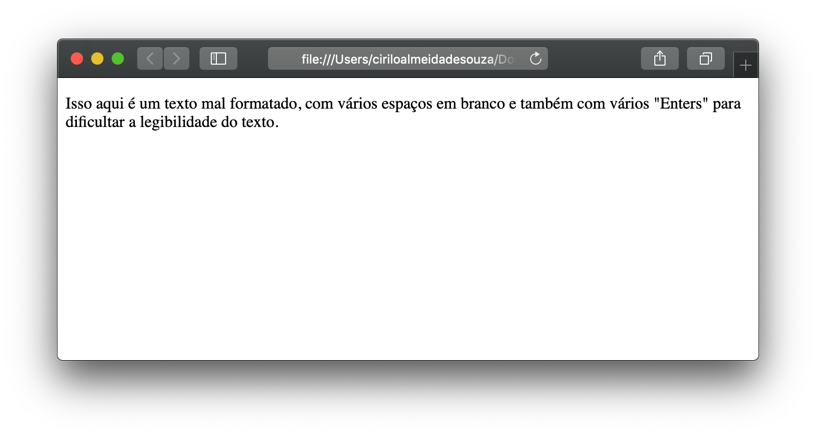

# Trabalhando com texto
  
  
&nbsp;
  
Quando criamos páginas Web nós adicionamos tags que são chamadas de elementos, esses **elementos** informam ao navegador o que deve ser exibido e como será exibido na tela. 
Nesta sessão, vamos ver em detalhes os elementos que são usados para inserir texto em páginas HTML. Estes elementos são divididos em duas partes, os **estruturais** e os **semânticos**, os estruturais servem para criar textos, como cabeçalhos e parágrafos já os semânticos provêm informações extras como dar ênfase ao texto. 
  
  
&nbsp;
  
## Cabeçalho:
O cabeçalho possui seis níveis, iniciando pelo \<h1\> e finalizando no <\h6\> sendo o \<h1\> utilizado para o título principal, por isso deve ser único e os demais podem se repetir ao longo da página. Os navegadores mostram o conteúdo dos cabeçalhos em tamanhos diferentes, de acordo com a sua ordem, ou seja, o <\h1\> será o maior e o <\h6\> o menor.

```
<html>
  <body>
      <h1>Esse é um título em H1</h1>
      <h2>Esse é um título em H2</h2>
      <h3>Esse é um título em H3</h3>
      <h4>Esse é um título em H4</h4>
      <h5>Esse é um título em H5</h5>
      <h6>Esse é um título em H6</h6>
  </body>
</html>
```

Veja como isso é mostrado no navegador:

  
  
&nbsp;
  
## Parágrafo:
Para criar um parágrafo, utilizamos o elemento \<p\>, tudo que for escrito entre este elemento será mostrado em uma ou várias linhas dependendo o tamanho do texto. Por padrão o navegador mostra cada novo parágrafo em uma linha diferente.
    
```
<html>
  <body>
      <p>
          Lorem ipsum dolor sit amet consectetur adipisicing elit. Nihil suscipit nam accusamus laudantium minus quia veniam itaque eos nemo aperiam quo sit voluptate hic, obcaecati, doloribus odio recusandae excepturi. Nesciunt?
      </p>
      <p>
          Lorem ipsum dolor sit amet consectetur, adipisicing elit. Voluptas facere error, dolore ad quae iusto numquam ratione tempora similique iure quisquam placeat consequatur labore molestias! Labore assumenda sequi itaque deleniti.
      </p>
  </body>
<html>
```


  
  
&nbsp;
  
## Bold e Itálico:
Para destacar uma parte do texto, podemos mostrá-los com a fonte em negrito ou itálico para fazer isso basta colocar o trecho do texto que queremos destacar entre os elementos \<b\> (negrito) e \<i\>  (itálico).

```
<html>
  <body>
      <p>
          <b>Lorem ipsum dolor sit amet consectetur adipisicing elit.</b> Nihil suscipit nam accusamus laudantium minus quia veniam itaque eos nemo aperiam quo sit voluptate hic, obcaecati, doloribus odio recusandae excepturi. Nesciunt?
      </p>
      <p>
          <i>Lorem ipsum dolor sit amet consectetur, adipisicing elit.</i> Voluptas facere error, dolore ad quae iusto numquam ratione tempora similique iure quisquam placeat consequatur labore molestias! Labore assumenda sequi itaque deleniti.
      </p>
  </body>
</html>
```


  
  
&nbsp;
  
## Quebra de linha:
Utilizamos o elemento <br> para quebrar parte do texto em uma nova linha.

```
<html>
  <body>
    <p>
        <b>Lorem ipsum dolor sit amet <br>consectetur adipisicing elit.</b> Nihil suscipit nam accusamus laudantium minus quia veniam itaque eos nemo aperiam quo sit voluptate hic, obcaecati, doloribus odio recusandae excepturi. Nesciunt?
    </p>
  </body>
</html>
```


  
  
&nbsp;
  
## Quebra de sessão:
Para separar sessões diferentes, ou parágrafos diferentes podemos utilizar o elemento \<hr\>. Ele cria uma linha que serve para separar um conteúdo de outro.

```
<html>
  <body>
      <p>
          Lorem, ipsum dolor sit amet consectetur adipisicing elit. Aliquid inventore odit ducimus doloribus fugit eius quis deserunt ipsa obcaecati animi nisi recusandae id minima, asperiores quia, tenetur ex tempore corrupti?
      </p>
      <hr>
      <p>
          Lorem, ipsum dolor sit amet consectetur adipisicing elit. Quae quia nulla quibusdam sunt corporis earum. Veniam eos tenetur, asperiores earum eaque officia. Perspiciatis earum praesentium veritatis, sit enim blanditiis exercitationem?
      </p>
  </body>
</html>
```


  
  
&nbsp;
  
## Texto pré-formatado:
Geralmente quando queremos apresentar poemas, ou linhas de código de alguma linguagem de programação em uma página utilizamos o elemento \<pre\>.

```
<html>
  <body>
    <pre>
        Batatinha quando nasce
        Espalha a rama pelo chão
        Menininha quando dorme 
        Põe a mão no coração
    </pre>
  </body>
</html>
```
  
  

  
  
&nbsp;
  
## Sub escrito e sobre escrito:
O elemento \<sub\> (sub escrito) geralmente é usado para formulas químicas, como H2O.

```
<html>
  <body>
      <p>A fórmula da água é H<sub>2</sub>O</p>
      <p>Qual o resultado de 2<sup>2</sup>?</p>
  </body>
<html>
```
  
  

  
  
&nbsp;
  
  
## Espaços em branco:
Caso você coloque vários espaços em branco em um parágrafo para melhorar o layout do seu texto na página Web saiba que eles serão ignorados pelo navegador que considerará somente o primeiro espaço em branco. O mesmo vale para as quebras de linhas inseridas através de “Enter” o navegador vai ignorar as quebras de linha e mostrar todo o conteúdo em uma mesma linha.

```
<html>
  <body>
      <p>Isso aqui é um texto mal formatado, com vários espaços              em branco
          e também com vários "Enters"
          para melhorar a legibilidade        do texto.
      </p>
  </body>
</html>
```
  
  

  
  
&nbsp;
  
  
*Legal né?! =D*
  
  
&nbsp;
  
  
## Ênfase e importância:
Utilizamos alguns elementos que não alteram a estrutura do texto, mas alteram a sua semântica, dando mais ênfase para uma parte específica do texto. Como o elemento \<strong\> que deixa o texto mais forte como se estivesse em negrito. E o \<em\> deixa o texto em itálico.

```
<html>
  <body>
      <p><strong>Esse é um exemplo de texto com &lt;strong&gt;</strong></p>
      <p><em>Esse é um exemplo de texto com &lt;em&gt;</em></p>
  </body>
</html>
```
  
  

  
  
&nbsp;
  
  
## Citação:
Utilizamos quando queremos citar uma frase dita por outra pessoa ou retirada de outro site podemos utilizar os elementos \<blockquote\> e o \<q\>. Repare que o \<blockquote\> identa o texto no navegador, porém não deve ser usado para este fim.

```
<html>
  <body>
      <blockquote cite="http://en.wikipedia.org/wiki/Winnie-the-Pooh">
          <p>Esta é uma citação retirada do wikipedia.</p> 
      </blockquote>
  </body>
</html>
```
  
  

  
  
&nbsp;
  
  
Existem outros elementos que trabalham com textos, sinta-se a vontade para pesquisar mais sobre cada um deles no site do W3C.


[< Retornar à página principal](../README.md)
