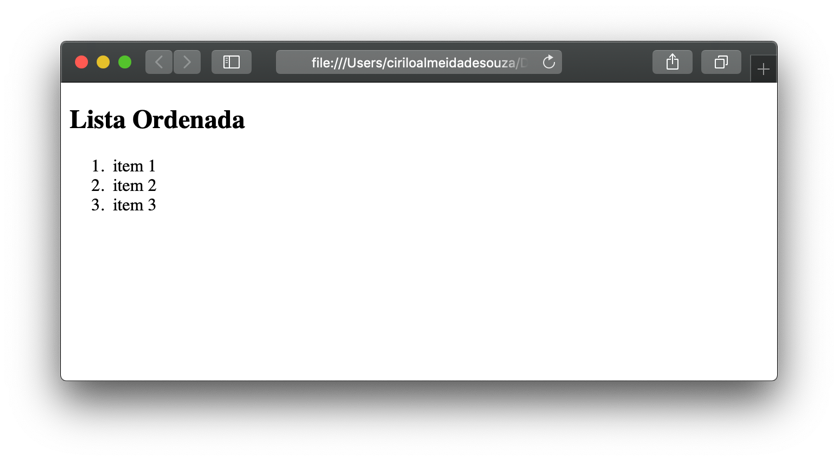

# Criando listas 
  
  
&nbsp;
  
  
Um monte de conteúdo da Web está organizado em listas, então o HTML tem elementos especiais para elas. Toda lista deve ter pelo menos 2 elementos. Os tipos mais comuns de listas são as ordenadas e as não ordenadas:
  
  
&nbsp;
  
  
## Lista ordenada
Utilizamos o elemento \<ol\> para criar uma lista ordenada. Para criar as linhas dentro da lista utilizamos o \<li\>.
  
```
<html>
  <body>
      <ol>
          <li>Água</li>
          <li>Cobalto</li>
          <li>Ferro</li>
          <li>Zinco</li>
      </ol>
  </body>
</html>
```
   
  
Veja como isso é mostrado no navegador:

  
  
Repare que o navegador coloca números na frente dos itens da lista
  
  
&nbsp;
  
  
## Lista não ordenada
Para criar uma lista não ordenada utilizamos o elemento \<ul\>, e também o \<li\> para criar as linhas dentro da lista.

```
<html>
  <body>
      <ul>
          <li>Água</li>
          <li>Cobalto</li>
          <li>Ferro</li>
          <li>Zinco</li>
      </ul>
  </body>
</html>
```
  
  

  
  
Repare que o navegador coloca bullets (bolinhas) na frente dos itens da lista
   
  
&nbsp;
  
  
  
[< Retornar à página principal](../README.md)
