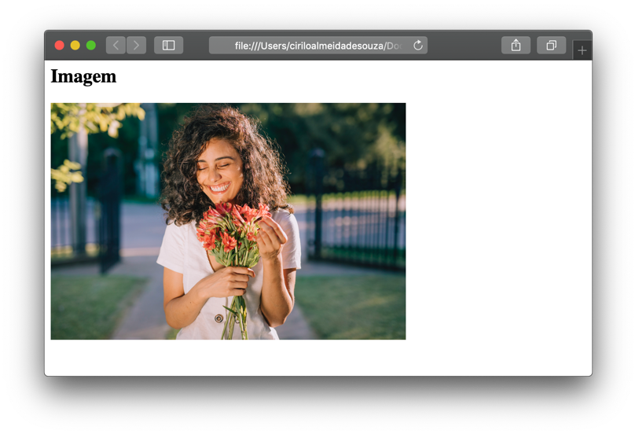
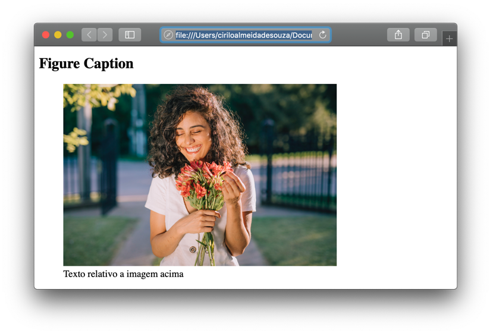

# Uma imagem vale mais que mil palavras

  
  
&nbsp;
  
  

Você pode querer inserir uma imagem na página por vários motivos, seja um logo, uma foto, um ícone, ilustração, etc. As imagens podem ser armazenadas em um diretório (pasta) dentro da estrutura do site geralmente chamada de ***img*** ou ***images*** ou serem carregadas a partir de um repositório externo.
Para adicionar uma imagem utilizamos o elemento \, ele é um elemento vazio, portanto não têm a tag de fechamento. Os atributos do \ são: src, alt e title

  
&nbsp;
  
  
## Atributo src:
Este é um atributo src é utilizado por outros elementos também, ele indica ao navegador o local de origem da imagem.

```
<html>
  <body>
      
  </body>
</html>
```

  
&nbsp;
  
  
## Atributo alt:
O atributo alt fornece um texto alternativo caso a imagem não carregue, ele é muito importante, pois, aplicativos de leitura de sites para deficientes visuais utilizam este atributo para informar aos deficientes do que se trata a imagem que está na tela. 
Não só isso, o Google também usa o atributo alt para fazer o rancking das páginas que serão exibidas para os uruários. Por tanto, é recomendado colocarmos um texto que faça sentido.

```
<html>
  <body>
      
  </body>
</html>
```
  
  
Veja como isso é mostrado no navegador:


  
&nbsp;
  
  
Com o surgimento do HTML 5 foi introduzido o elemento semântico \<figure\>. Nós o utilizamos quando uma imagem tem um texto embaixo, ele pode conter diversas imagens. O texto é inserido dentro do elemento \<figcaption\>.

```
<html>
  <body>
    <figure>
       
       <figcaption>O texto relativo a imagem vai aqui!</figcaption>
    </figure>
  </body>
</html>
```
  
  



[< Retornar à página principal](../README.md)
  
  
[Ir para a próxima página >](8-O-que-é-CSS.md)
