# Aplicando estilo com CSS
  
  
&nbsp;
  
  
Nós já vimos o que são os seletores de elemento, id e classes. Agora vamos conhecer algumas propriedades CSS que nos ajudarão a aplicar um estilo legal às nossas páginas HTML.
  
  
&nbsp;
  
  
## Cores
  
  
O CSS suporta 140 nomes de cores padrão, para todas as outras podemos utilizar os códigos RGB ou Hexadecimal. Para consultar a lista de cores padrão acesse: 
[W3Schools](https://www.w3schools.com/colors/colors_names.asp)
  
  
&nbsp;
  
  
### Cor de elementos de texto:
A mesma propriedade vale para os elementos de lista, links, parágrafos e cabeçalhos basta alterarmos o seletor para o elemento que deseja alterar.
  
```css
  p{ color: white; }

  a{ color: pink; }

  h1{ color: darkblue; }
```
  
  
&nbsp;
  
  
### Cor de fundo:

```css
  div{ background-color: black; }
```
  
  
&nbsp;
  
  
### Cor de borda:
Como vimos anteriormente, os elementos de bloco possuem bordas, e podemos estiliza-las utilizando a propriedade border-color do CSS.

```css
  div{ border-color: aqua; }
```
  
  
&nbsp;
  
  
### Cor em RBG:
As cores RBG são o resultado da junção de três cores primárias o vermelho (Red), o verde (Green) e o Azul (Blue). Seus valores vão de 0 a 255 para cada canal de cor, ou seja, podemos ter diversas combinações de cores manipulando os canais.

```css
  div{ background-color: RGB (255, 130, 71); }
```
  
  
Cada número separado por vírgula representa um canal de cor, se alterarmos os valores teremos uma cor diferente. O RGB também nos permite aplicar transparência a cor, é o que chamamos de RGBA, o A representa o canal Alfa que define a opacidade da cor seu valor vai de 0 a 1 sendo 0 totalmente transparente e 1 totalmente opaco.

```css
  #bloco1{
      background-color: rgba(0, 255, 255, 0);
      color: black;
  }

  #bloco2{background-color: rgba(0, 255, 255, 0.25);}

  #bloco3{background-color: rgba(0, 255, 255, 0.5);}

  #bloco4{background-color: rgba(0, 255, 255, 1);}
```
  
  

  
  
&nbsp;
  
  
## Backgrounds
Os backgrounds ficam atrás dos elementos como se estivessem em segundo plano, podemos aplicar imagens, cores e vídeos em um background.
  
  
### Cor de fundo:

```css
  div{ background-color: black; }
```
  
  
&nbsp;
  
  
### Imagens como fundo:

```css
  div{ background-image: url('mulher.jpg'); }
```
  
  
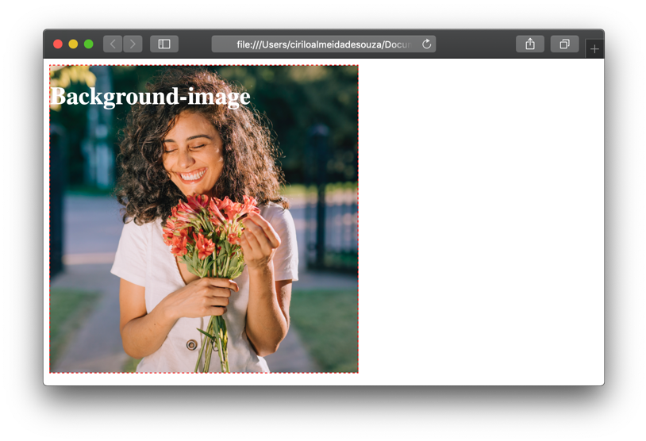
  
  
&nbsp;
  
  
### Repetição de imagens:
As imagens de background podem se repetir nos eixos X (horizontal) e Y (vertical), se uma imagem é pequena para um elemento, ela será repetida por padrão em ambos os eixos. Porém podemos mudar esse comportamento com as propriedades background-repeat: repeat-x e background-repeat: repeat-y. 
  
  
```css
  div{ 
    background-image: url('mulher.jpg');
    background-repeat: repeat-x;
 }
```
  
  
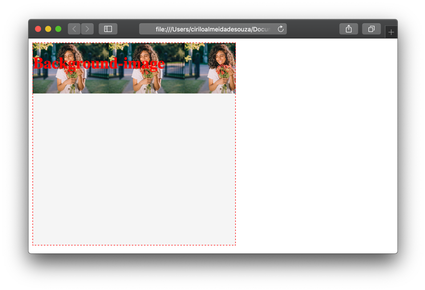
  
  
```css
  div{ 
    background-image: url('mulher.jpg');
    background-repeat: repeat-y;
 }
```
  
  
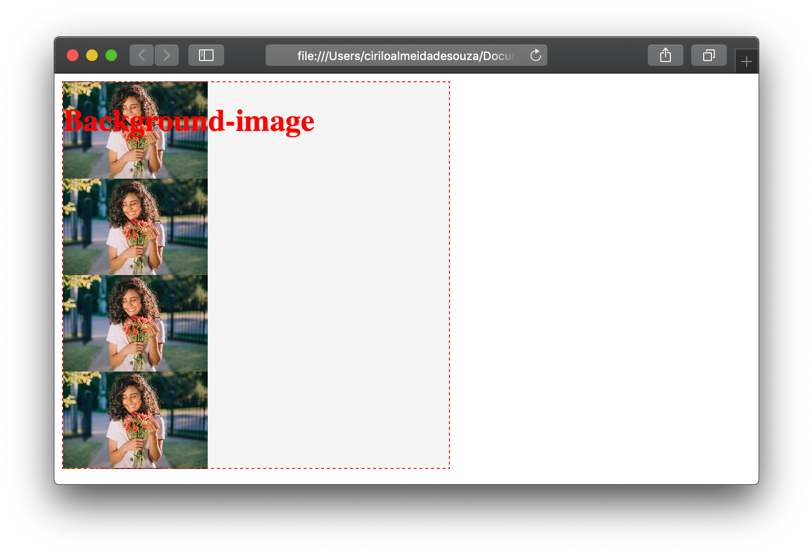
  
  
Podemos também bloquear a repetição das imagens com o valor de propriedade no-repeat.

```css
  div{ 
    background-image: url('mulher.jpg');
    background-repeat: no-repeat;
 }
```
  
  
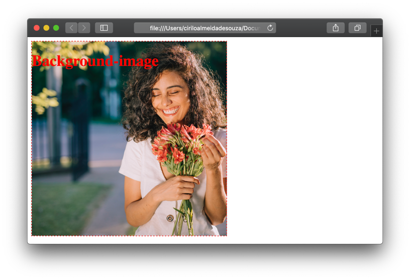
  
  
&nbsp;
  
  
## Bordas

Como já falamos os elementos de bloco possuem bordas, que o delimitam. Também podemos aplicar estilo a elas com a propriedade border.
  
  
&nbsp;
  
  
### Estilo da borda:
Uma borda pode ser solida, tracejada, pontilhada, ou uma mescla de estilos. Podemos inserir até 4 estilos de borda, sendo que cada um será aplicado a uma borda iniciando pela superior.

```css
  div{ 
    border-width: 2px;
    border-color: red;
    border-style: solid dotted dashed solid;
 }
```
  
  

  
  
| Valor  | O que faz                                                  |
|--------|------------------------------------------------------------|
| Double | Cria uma borda dupla                                       |
| Groove | Cria um efeito 3d na borda, como se fosse um vinco externo |
| Ridge  | Cria um efeito 3d na borda                                 |
| Inset  | Cria um efeito 3d na borda                                 |
| Outset | Cria um efeito 3d na borda                                 |
| Hidden | Borda oculta                                               |
  
  
&nbsp;
  
  
### Cor da borda:

```css
  div{ border-color: black; }
```
  
  
&nbsp;
  
  
### Sem borda:


```css
  div{ border-color: none; }
```
  
  
&nbsp;
  
  
### Largura da borda:

```css
  div{ border-width: 2px; }
```
  
  
&nbsp;
  
  
### Bordas arredondadas:

```css
  div{ border-radius: 10px; }
```
  
  
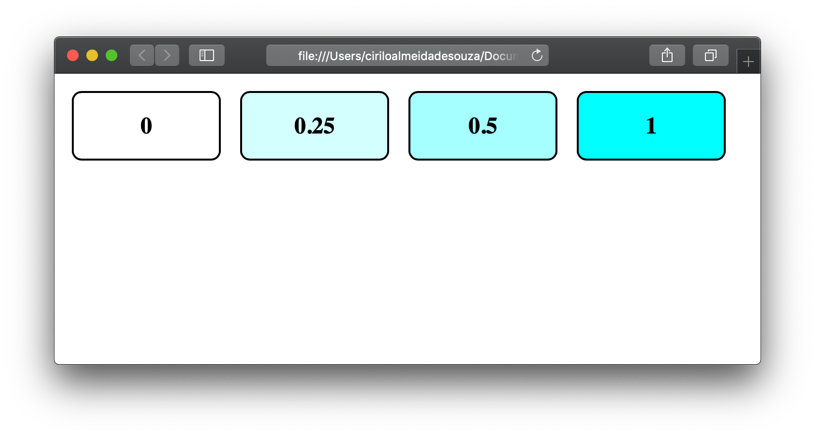
  
  
Podemos também uma borda para apenas um dos lados do nosso elemento, como as propriedades border-top, border-botom, border-left e border-right

```css
  #bloco1{ border-top: 2px solid black; }

  #bloco2{ border-bottom: 2px solid black; }

  #bloco3{ border-left: 2px solid black; }

  #bloco4{ border-right: 2px solid black; }
```
  
  
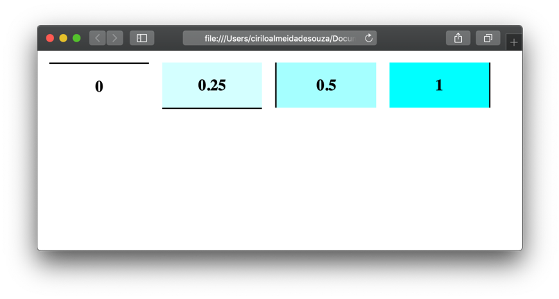
  
  
Perceba que aplicamos vários valores a propriedade border, o CSS nos permite fazer isso para economizarmos linhas de cógido.
  
  
&nbsp;
  
  
## Margens

A margem é o espaçamento externo de um elemento de bloco para outro. Assim como o border, podemos informar até quatro valores para a propriedade margin. Os valores serão aplicados da seguinte forma: margem superior, direita, inferior e esquerda.

```css
  div{ margin: 10px 20px 10px 20px; }
```
  
  
Se quisermos aplicar os mesmos valores nas margens superior e inferior, mas valores diferentes nas margens da esquerda e direita, basta aplicarmos dois valores à propriedade.

```css
  div{ margin: 10px 20px; }
```
  
  
Ou podemos utilizar os seletores

```css
  div{
    margin-top: 10px;
    margin-bottom: 10px;
    margin-left: 20px;
    margin-right: 20px
  }
```
  
  

  
  
&nbsp;
  
  
## Paddins

Diferente do margin, o padding é a distância entre os elementos filhos para a borda interna do elemento pai.
  
  
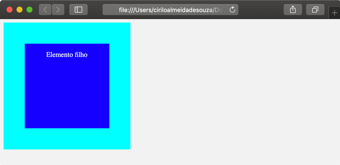
  
  
O elemento pai possui 300px de altura e largura, já o elemento filho possui 200px de altura e largura. Aplicamos um padding no elemento pai de 50px isso dá a impressão de que o elemento filho está centralizado dentro do pai. 
  
  
```css
  #pai{
      padding: 50px;
      box-sizing: border-box;
  }

  #filho{
      background-color: blue;
  }
```
  
  
Repare que utilizamos um seletor chamado box-sizing, isso porque ao aplicarmos o padding o elemento pai irá incrementar ao seu tamanho original a quantidade de pixels do padding. Como aplicamos um padding de 50px na parte superior e inferior, o elemento pai teria no final 400px e não 300px como definido anteriormente, usamos o box-sizing para corrigir isso, desta forma, o elemento pai se manterá com 300px.

Podemos também usar os seletores:

```css
  #pai{
      padding-top: 50px;
      padding-right: 50px;
      padding-bottom: 50px;
      padding-left: 50px;
  }
```
  
  
Ou informar os valores de uma só vez através do seletor padding. Lembrando que os valores são aplicados da seguinte forma: padding superior, direita, inferior e esquerda

```css
  #pai{ 
      padding: 50px 30px 50px 30px; 
  }
```
  
  
&nbsp;
  
  
## Largura e altura
  
Os elementos de bloco possuem também uma largura (width) e uma altura (height). Ambas podem ser alteradas via CSS através das propriedades width e height.
  

```css
  #pai{
      width: 300px;
      height: 300px;
  }

  #filho{
      width: 200px;
      height: 200px;
  }
```
  
  
**Max-width & min-width:**
O max-width define a largura máxima de um elemento, o min-width define a largura mínima. Mesmo ao dar um zoom ou redimensionar a janela do navegador o elemento irá respeitar o seu tamanho máximo e mínimo. 

**Max-height & min-height:**
Faz a mesma coisa que as propriedades acima, porém trabalha com a altura do elemento.
  
  
&nbsp;
  
  
## Textos
  
### Cor de elementos de texto:
A mesma propriedade vale para os elementos de lista, links, parágrafos e cabeçalhos basta alterarmos o seletor para o elemento que deseja alterar.

```css
    p{ color: white; }
    a{ color: pink; }
    h1{ color: darkblue; }
```
  
  
&nbsp;
  
  
### Alinhamento:
O alinhamento do texto pode ser à esquerda (padrão), no centro, a direita ou justificado. 
  
```css
  #txt1{
      text-align: left; /* Alinha o texto a esquerda (padrão)*/
  }

  #txt2{
      text-align: center; /* Alinha o texto no centro */
  }

  #txt3{
      text-align: right; /* Alinha o texto a direita */
  }

  #txt4{
      text-align: justify; /* Alinha de forma que o espaçamanto das margens sejam iguais em todas a linhas*/
  }
```
  
  
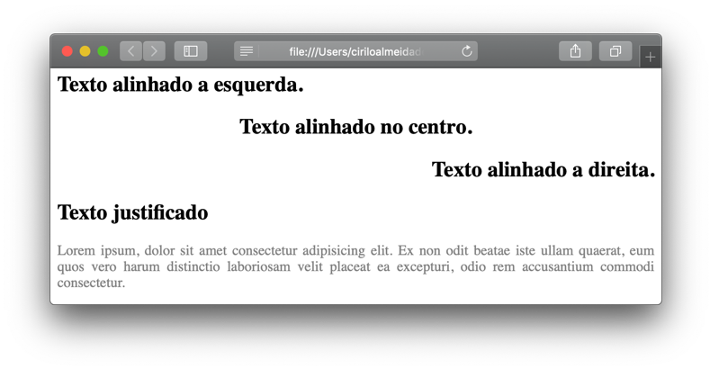

  
  
&nbsp;
  
  
### Decoração de texto:
A propriedade cria uma linha que pode ser colocada sobre o texto, abaixo dele, ou no meio. Geralmente usamos o valor none para alterarmos as características padrão dos elementos de link.

```css
    #txt1{ text-decoration: none; }

    #txt2{ text-decoration: underline; }

    #txt3{ text-decoration: overline; }

    #txt4{ text-decoration: line-through; }
```
  
  
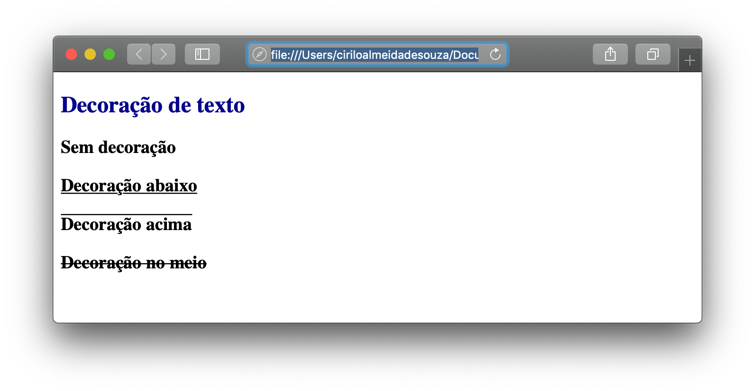
  
  
&nbsp;
  
  
### Transformação de texto:
Muitas vezes precisamos que certos textos sejam exibidos pelo navegador em maiúsculo ou minúsculo, para a nossa sorte não é necessário ficar mudando a forma com a qual digitamos o texto durante o desenvolvimento da página web porque podemos utilizar a propriedade text-transform. Esta propriedade possui três valores, UPPERCASE, lowecase e Captalize.

```css
    #txt1{ text-transform: uppercase; }

    #txt2{ text-transform: lowercase; }

    #txt3{ text-transform: capitalize; }
```
  
  
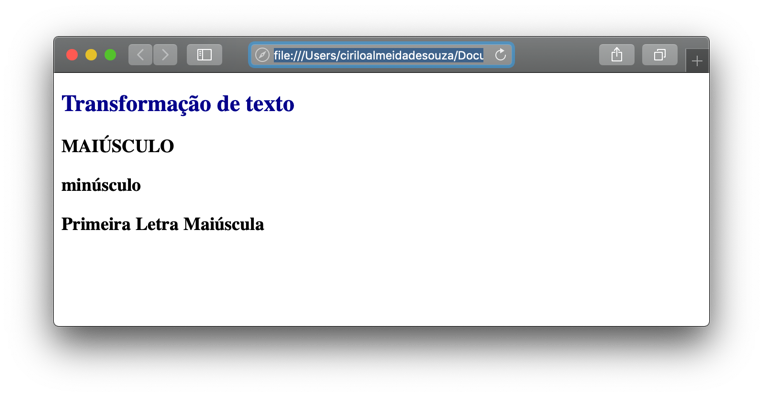

  
  
&nbsp;
  
  
### Identação:
Adiciona um espaço a esquerda na primeira linha de um parágrafo.

```css
    #txt1{ text-indent: 20px; }
```
  

  
  
&nbsp;
  
  
### Espaçamento entre letras e palavras:
Os navegadores possuem um espaçamento padrão entre cada caractere de texto, mas podemos mudar esse comportamento para melhorar a legibilidade em determinadas fontes com a propriedade letter-spacing.

```css
    #txt1{ letter-spacing: 5px; }
```
  
  
Da mesma forma que o letter-spacing é possível aumentar o espaçamento padrão entre as palavras com a propriedade word-spacing.

```css
    #txt1{ word-spacing: 5px; }
```
  
  
Ambas as propriedades aceitam valores negativos, isso fará com que as letras ou palavras fiquem mais próximas umas das outras.

```css
    #txt1{ word-spacing: -5px; }
```
  
  
&nbsp;
  
  
### Tamanho da linha:
Por padrão os navegadores mostram parágrafos com uma fonte de 16px. Para melhorar a leitura podemos aumentar o tamanho das linhas, isso com que o espaçamento entre elas seja maior ou menor.

```css
    #txt1{ line-height: 50px; }
```
  
  

  
  
&nbsp;
  
  
## Fontes

Existem quatro tipos de fontes, as serifadas, não serifadas, cursivas e ornamentais. Fontes serifadas possuem uma borda nas extremidades e dependendo do tipo de fonte usada na página web ela pode ter a sua versão com ou sem serifa, precisamos especificar qual tipo queremos utilizar nos nossos textos.
  
  
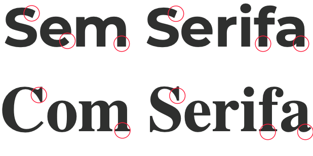
  
  
Um ótimo exemplo para mostrarmos uma fonte serifada é a Times New Roman, que utilizamos para escrever esse trecho de texto, reparem que ela tem uma bordinha nas extremidades. 
Já as fontes sem serifa não têm essa bordinha. Perceberam a diferença?
  
A propriedade font-family permite aplicarmos diversas fontes para um texto, isso porque se um navegador não suportar a primeira fonte, ele usará a próxima e assim por diante. Recomendo utilizar a fonte que você queira aplicar no texto em primeiro lugar, logo após a propriedade e posteriormente as demais fontes mais genéricas separadas por vírgula.

```css
    #txt1{ font-family: 'Montserrat', Verdana, Tahoma, sans-serif; }
```
  
  
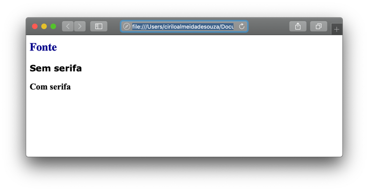
  
  
 Neste caso como o navegador não suporta a fonte Montserrat ele monstra o texto usando a segunda opção que é a fonte Verdana.

  
  
&nbsp;
  
  
### Importando fontes:
O parâmetro @import pode ser usado para importar qualquer estilo aplicado em outro arquivo CSS. Ele também pode ser usado para importar fontes, isso nos permite utilizar sites como o Google Fonts.

```css
   @import url('https://fonts.googleapis.com/css?family=Montserrat');

  #bloco1{ font-family: 'Montserrat', Verdana, Tahoma, sans-serif; }
```
  
  
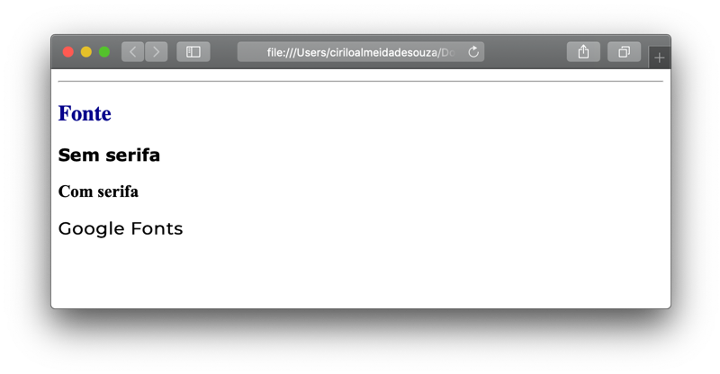
  
  
No site do Google Fonts, procure por Montserrat.
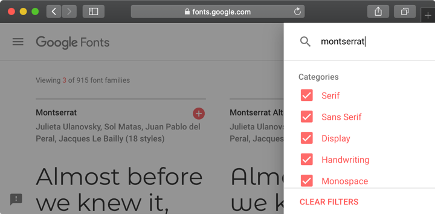
    
    
Clique no sinal de mais (+) para adicionar a fonte.
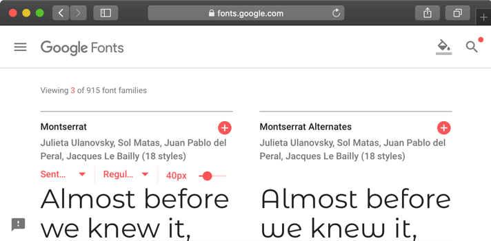
  
  
Clique na barra inferior para acessar as propriedades da fonte.
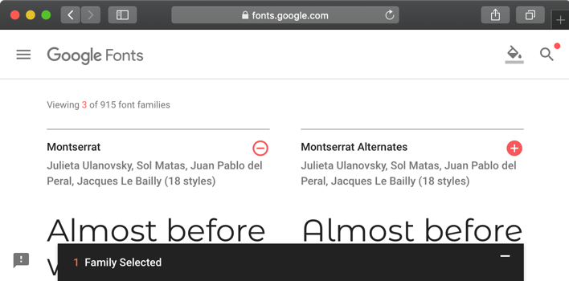
  
  
Clique em Import e selecione toda a linha começando por @import
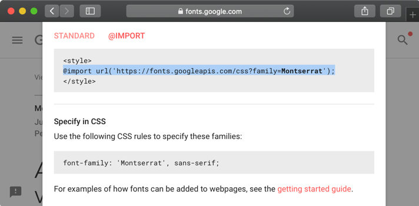
  
  
Cole no topo de seu arquivo CSS.

```css
    @import url('https://fonts.googleapis.com/css?family=Montserrat:400,700');
```
  
  
&nbsp;
  
  
### Peso e estilo e tamanho da fonte:
Para deixar a fonte em itálico podemos usar a propriedade font-style.

```css
    #bloco1{
      font-family: 'Montserrat', Verdana, Tahoma, sans-serif;
      font-style: italic;
    }
```

O mesmo pode ser feito usando o valor bold ou semi-bold, porém a fonte deve suportar esses valores.
  
  
&nbsp;
  
  
### Tamanho da fonte:
Como falamos anteriormente, as fontes têm um tamanho padrão nos navegadores de 16px, mas podemos deixa-las maiores ou menores de acordo com a nossa necessidade com a propriedade font-size.

```css
    #bloco1{
        font-family: 'Montserrat', Verdana, Tahoma, sans-serif;
        font-style: italic;
        font-weight: 700;
        font-size: 20px
    }
```
  
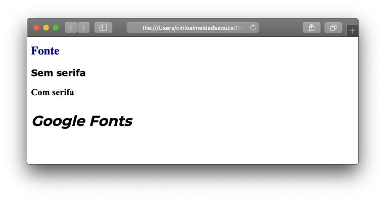
  
  
Podemos inserir o mesmo valor em EM. O EM é um padrão que permite que o texto seja redimensionado ao dar zoom na janela do navegador.
  
1em é igual a 16px
  
Se quisermos que uma fonte tenha o tamanho de 32px, basta dividirmos o valor por 16
32px / 16px = 2em
  
  
Com o surgimento dos sites responsivos onde podem ser acessados através de smartphones, tvs, watches, etc. Temos a necessidade de que as fontes sejam redimensionadas para cada um destes dispositivos.

```css
    #bloco1{ font-size: 2em; }
```
  
ou

```css
    #bloco1{ font-size: 2vw; }
```
  
   
&nbsp;
  
  
[< Retornar à página principal](../README.md)
  
[Ir para a próxima página >](10-Float.md)
